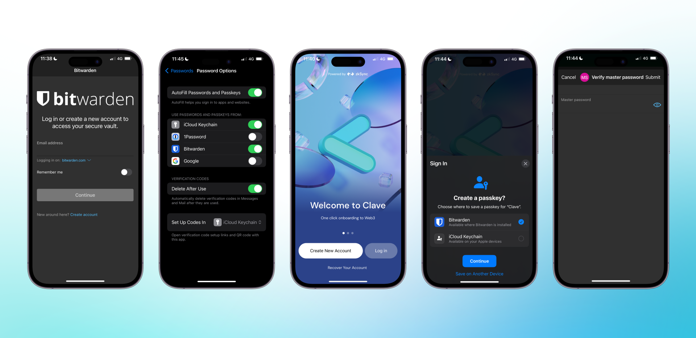

If you are using Bitwarden on your iOS or Android device, you should first add another password account to your settings.

- If you are using an iOS device, go to **Settings -> Passwords -> Password Options -> Add Bitwarden**.
- If you are using an Android device, go to **Settings -> Passwords -> Passwords and Automatic Filling -> Add Bitwarden**.

1. Then open the Clave app.
2. Click on **“Create new account.”**
3. You will see the **“Create passkey”** pop-up.
4. Select **Bitwarden** as your passkey option.
5. Click **continue**, and you created your Clave account!

