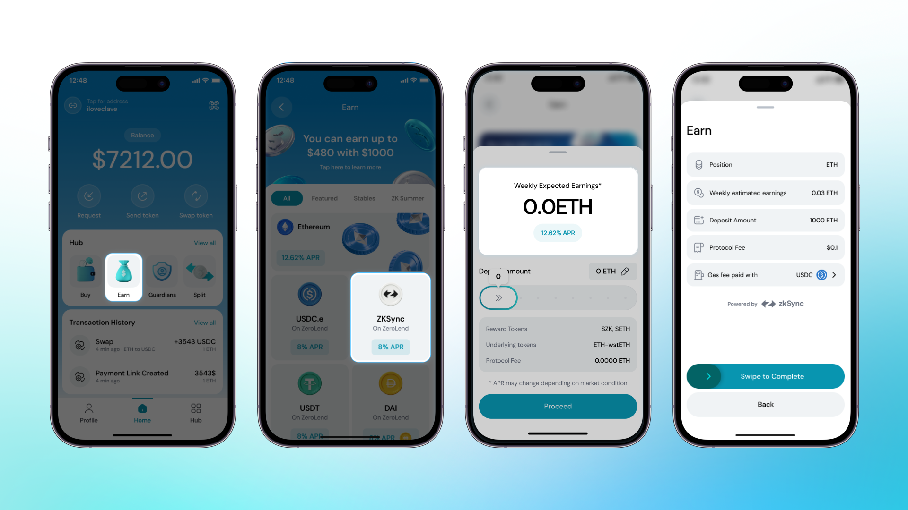

At Clave, we have integrated DEX Pools and one-sided staking pools to enable users to earn passive income by staking their assets in these pools.

To earn money on Earn Hub, you need a funded wallet first. If you haven't deposited funds into Clave, follow this guide: [How to Fund Your Wallet on ZKsync](how-to-fund-your-wallet-on-zksync).

Thanks to Account Abstraction, users no longer need to perform multiple transactions while using DeFi applications. This is why earning on Clave is just one click away!

**Step-by-Step Guide to Start Earning:**

1. **Go to Hub and Select Earn**: Open the Clave app, navigate to the Hub, and select the Earn option.

2. **View Yield Opportunities**:You will see various yield opportunities. Select the asset you want to stake and continue.

3. **Select Deposit Amount**: Choose how much you want to deposit into the Earn Pool and continue.

4. **Complete biometric authentication** after reviewing the transaction.

That’s all! You’ve started to make money with your earnings.

### How to Claim Your Earnings and Withdraw Your Funds

You can withdraw your assets anytime. There's no lock-up period, and users are free to withdraw their assets whenever they want.

**How to Withdraw Funds**

1. **Go to Earn Hub** and select the position you want to withdraw from.

2. **Click the Withdraw** button.

3. **Type How Much You Want to Withdraw**. Enter the amount you wish to withdraw.

4. **Click Collect and Withdraw** and you'll be withdrawn your funds. 

You’re done! Now you’ve withdrawn your funds and can use them anywhere.

Where those yield coming from? Lets learn in the next section: