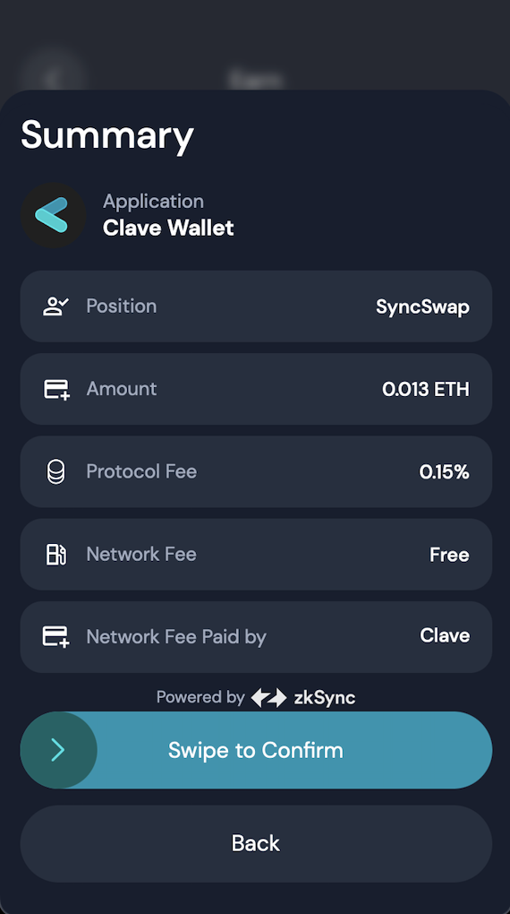

Clave offers two earning types: Collectable and Compounded. Collectable earnings provide immediate liquidity and flexibility, allowing you to withdraw and use funds anytime. Compounded earnings automatically reinvest, maximizing returns through compound interest. Both methods ensure 24/7 access to your earnings without any lock-up period.

## Collectable Earnings
Collectable earnings are funds you can withdraw and use at your discretion. These earnings provide immediate liquidity and flexibility, giving you the option to reinvest, spend, or save as you see fit. 
Our ZK staking contract operates using the collectable earning method, providing you with the flexibility and immediate access to your rewards whenever you choose.

## Compounded Earnings
Compounded earnings are automatically reinvested into the pool, allowing your earnings to generate even more income over time. This method leverages the power of compound interest, maximizing your returns in the long run. With both earning methods, you can access your earnings and assets 24/7 without any lock-up period.
ZeroLend pools utilize this method to offer the best yield rates to our users, ensuring you have access to your funds whenever you need them.

 <Accordion title="Why do some protocols take a fee when depositing funds to Earn?">
        Adding LP to AMM pools comes with an extra risk: Impermanent Loss. To minimize this risk, we only use pools that have same asset category (e.g. WstETH/ETH). So, the price change and Impermanent Loss risk is also minimal.
        

    </Accordion>