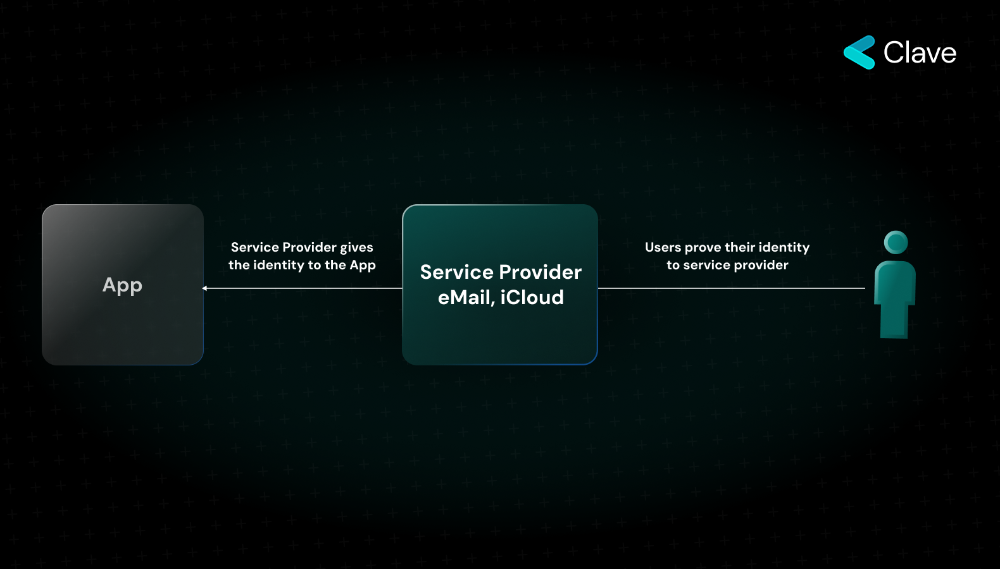

## Understanding Ownership in the Digital Age: Web2 vs. Web3 & The Role of Passkey Signer

The concept of 'ownership' on the internet has transformed dramatically over the years, particularly with the evolution from Web2 to Web3. Let's dissect this transformation and discuss how cutting-edge technologies like Secure Enclaves are reshaping our understanding of digital identity and security.

### Ownership in Web2

Web2, the second iteration of the internet, primarily focuses on user-generated content and the rise of social media platforms. In the Web2 era, digital ownership operates largely through a centralized, service provider-centric model. Here's how it typically flows:

- Users present proof of their account to a service provider, such as iCloud or Gmail.
- The service provider verifies the user's identity.
- Once authenticated, this identity is then conveyed to various apps or platforms that the user wishes to access.

This centralized model boasts a significant advantage: the ease with which users can recover their accounts and easily access their accounts. However, this convenience comes at a cost. The entire system hinges on the trustworthiness of the middleman – the service provider. This significant trust assumption represents a potential vulnerability, prompting the shift towards the decentralized, cryptographic key-based identity verification seen in Web3.

### Ownership in Web3: A Decentralized Trustless Paradigm

In the evolution of the digital realm, Web3 stands out as a transformative chapter that seeks to redefine the essence of online ownership. Fundamentally, Web3 is designed to be trustless, meaning users shouldn't have to rely on third-party intermediaries or "middlemen" to assert their ownership or identity online.

Central to the trustless nature of Web3 is Elliptic Curve Cryptography (ECC). ECC allows users to prove their identity without the need for a middleman. It provides strong security while using shorter codes, making it ideal for Web3's decentralized platforms. One of the most evident manifestations of ECC in the Web3 environment is the 12-word mnemonic phrase often required to access a user's account. These words, derived from their cryptographic keys, act as a passphrase to their digital wallets or accounts.

However, this innovation doesn't come without its challenges. The responsibility of safeguarding these 12 words lies solely with the user. Losing one's 12-word phrase in the Web3 ecosystem could mean permanent loss of access to one's digital assets and identity.

### A New Paradigm to Prove Identity in Web3: Hardware Secured Signing - Passkeys

As Web3 reshapes the digital landscape, introducing decentralized and trustless operations, there's an emerging need for heightened security measures. Enter the concept of Hardware Sign, an innovative approach that promises to take digital identity verification to new heights.

#### Understanding the Secure Enclave

The Secure Enclave is an advanced hardware feature, specifically designed to act as a protective shield around users' most sensitive data. Unlike other parts of a device, which might handle everything from app processes to notifications, the Secure Enclave is a distinct microchip, isolated from all other components of the device. This separation ensures that sensitive data, such as biometric information and cryptographic keys, are isolated from potential threats.

#### Accessing the Secure Enclave

Data stored within the Secure Enclave can only be accessed through either a passcode or biometric authentication methods like Face ID or Touch ID. This adds an extra layer of security, ensuring that even if a device is lost or stolen, the data within the Secure Enclave remains protected.

### Integrating Secure Enclave into Web3

Perhaps the most groundbreaking feature of the Secure Enclave, especially in the realm of Web3, is its support for Elliptic Curve Cryptography (ECC). This means that the Secure Enclave can generate and manage cryptographic key pairs, crucial for digital transactions and identity verification in the Web3 ecosystem.

Even more impressive is the capability of the Secure Enclave to sign messages using the internally generated key, without ever allowing the extraction of the key from its confines. For Web3 users, this has profound implications. Instead of remembering a 12-word mnemonic phrase to access their accounts, users can simply use their biometric data.

### Our Key Management Approach

#### Our Key Management System with Secure Enclaves

At the core of our approach is the utilization of Secure Enclaves. The cryptographic key, essential for your transactions, is generated within this enclave and importantly, it never leaves its confines. This encapsulation ensures the key's security even during transaction processes.

#### The Key Creation Process

The journey starts when a user decides to generate a cryptographic key pair:

1. **Biometric Authentication**: The user initiates the key generation process by providing biometric authentication, such as a fingerprint or facial recognition.
2. **Internal Key Generation**: Post authentication, the Secure Enclave creates the cryptographic key pair. The generated key remains within the Secure Enclave, never venturing outside, ensuring its absolute security.

#### The Transaction Process

Once the key is securely generated, it can be used to sign messages, a fundamental step for initiating transactions in the Web3 world:

1. **Initiating the Signing Process**: When a user wishes to make a transaction, the app takes the required message and forwards a signing request to the Secure Enclave.
2. **Biometric Authentication for Signing**: To confirm the signing request, the user provides biometric authentication once again.
3. **Internal Message Signing**: The Secure Enclave, upon receiving user authorization, signs the message with the key created inside the Secure Enclave.
4. **Ready for the Blockchain**: The signed message is now in a transaction format, ready to be recorded on the blockchain.

### What If The User Loses The Device?

With Secure Enclave, even if your device falls into the wrong hands, accessing sensitive information is next to impossible. Recovering your account is possible, and we will dive into our recovery approach in the [next section](social-recovery)