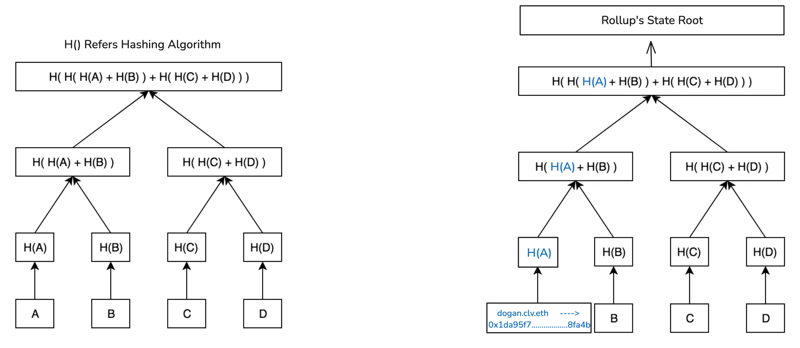
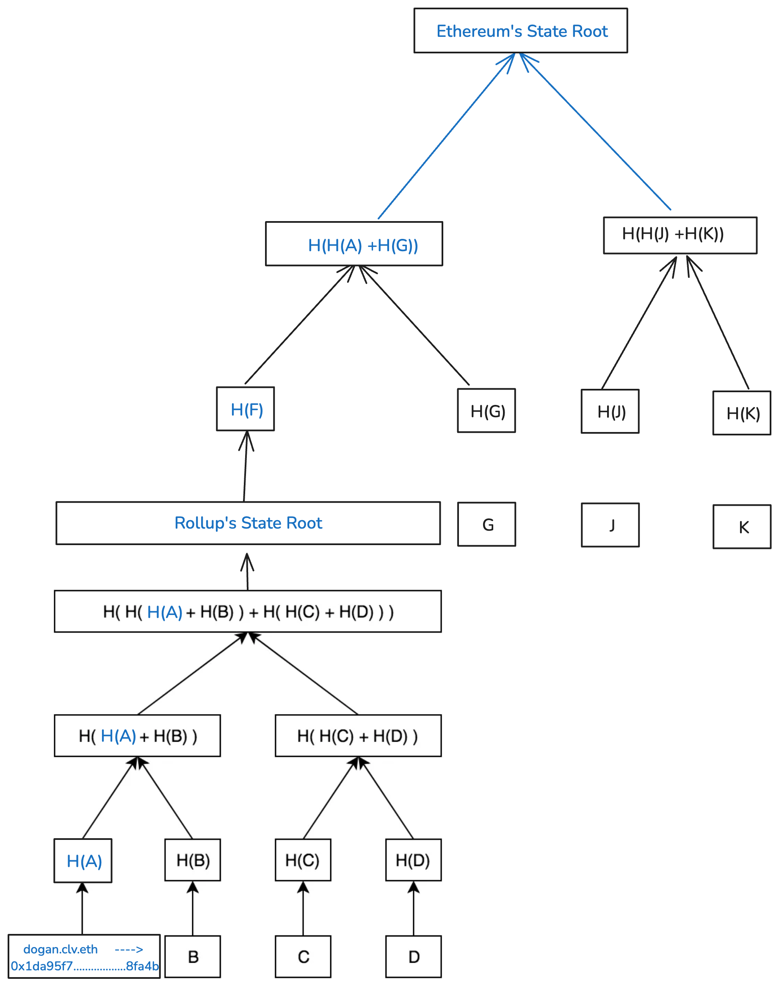
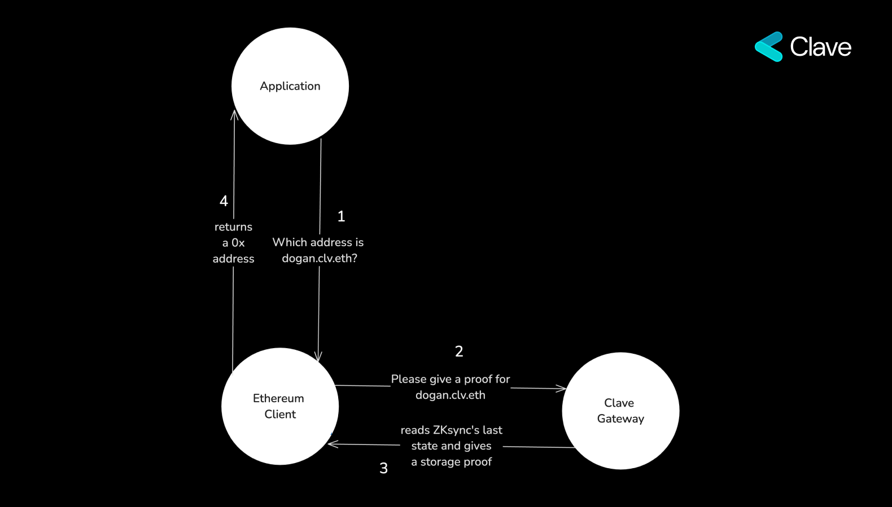

The Ethereum Name Service (ENS) is a decentralized, open, and extensible naming system built on the Ethereum blockchain. ENS translates human-readable names like 'alice.eth' into machine-readable identifiers, such as Ethereum addresses, other cryptocurrency addresses, content hashes, metadata, and more. It also offers 'reverse resolution,' allowing Ethereum addresses to be associated with metadata like primary names or interface descriptions.

Top-Level Domains (TLDs) such as .eth and .test are managed by smart contracts known as registrars. These registrars define the rules for allocating names within their domains, ensuring seamless compatibility with the Domain Name System (DNS).

When users register a name, they are typically registering a second-level domain (2LD) under the .eth TLD—such as 'clv.eth'. ENS names can also generate subdomains; for example, 'clv.eth' can create 'dogan.clv.eth'.

**CCIP-Read (ERC-3668)** enables data retrieval from any source using a client-side method. This feature is particularly useful for cross-chain and off-chain subname resolvers. While the core ENS protocol operates on Ethereum, CCIP-Read provides the flexibility to extend subnames to off-chain environments and rollups, broadening the scope of ENS functionality beyond the Ethereum blockchain.

If an ENS subname lives on an Ethereum rollup and aims to maintain trustlessness, the CCIP solution necessitates storage proofs. These proofs validate that the subname exists onchain and that the resolver calculation is accurate. This ensures that the integrity of the subname's data is preserved, even when operating in off-chain environments, by providing cryptographic proof that the subname's state is a part of the rollup's state root that lives on Ethereum. 

## Overview of ZKsync's Storage Proofs
ZKsync is a layer-2 scaling solution for Ethereum, designed to increase transaction throughput and reduce fees while maintaining the security and decentralization of the Ethereum network. It operates as a rollup that posts state roots and Zero Knowledge proofs to Ethereum, ensuring the integrity of computations performed on ZKsync. Although ZKsync is an EVM-compatible blockchain, it uses a different hashing method called Blake2, which differs from Ethereum's SHA-256 hashing algorithm.

Ethereum uses a specialized Merkle tree method called the Merkle Patricia tree, which enables anyone to generate storage proofs that verify a specific piece of storage is part of the state root and is valid. This allows us to prove that data on a rollup is authentic and integrated into the rollup's state on Ethereum. This is similar for ZKsync, but with a key difference: the hashing method. To prove a storage slot on ZKsync, you need to use the Blake2 algorithm. 

Clave utilizes storage slots at CCIP read, to explain it let's look at how CCIP works at a fundamental level. 

The Cross Chain Interoperability Protocol (CCIP Read) is a client-side protocol designed to facilitate off-chain data retrieval in a secure and decentralized manner. It introduces the `OffchainLookup` error, which acts as a trigger for the client to handle specific off-chain data requests.

When the client encounters the `OffchainLookup` error, it responds by calling a specified gateway URL, which in this case is the Clave Gateway. The Clave Gateway then provides a storage proof for the requested subname. The client subsequently verifies this proof, ensuring that the subname data is authentic and trustless. This mechanism makes Clave subnames trustless by design.

Here’s the `OffchainLookup` error definition:

```
error OffchainLookup(
    address sender,
    string[] urls,// Calls the Clave Gateway
    bytes callData,
    bytes4 callbackFunction,
    bytes extraData
);
```
to learn more, you can check [ENS's website:](https://docs.ens.domains/resolvers/ccip-read)

However, clients have a gas limit of 30 million, while existing Blake2 Solidity verifiers consumed around 1 billion gas, rendering our method impractical. To overcome this limitation, we developed a library with ENS that performs the Blake2 hashing algorithm efficiently, keeping gas consumption under the 30 million gas limit.

### The current flow for resolving a Clave Username is as follows:

1. An application queries the Ethereum client for the address associated with `dogan.clv.eth`.
2. The Ethereum client calls the Clave Gateway for a proof.
3. The Clave Gateway provides a storage proof and the necessary data to prove the name on-chain.
4. The Ethereum client simulates the proof and returns the corresponding `0x` address to the application.

This process is completely trustless and incurs zero fees!



## How We Store Names on ZKsync

We drew significant inspiration from the core ENS protocol and decided to make Clave usernames immutable, decentralized, and free. Clave usernames are unique to Clave addresses, and once a username is registered onchain, it cannot be changed - even by the user or by Clave.

Clave usernames are non-transferable and immutable, ensuring their uniquness for users. 

```solidity
function _beforeTokenTransfer(address from, address to, uint256) internal view override {
    require(
        from == address(0) || to == address(0),
        '[_beforeTokenTransfer] Transfers are not allowed..'
    );

    require(
        to == address(0) || balanceOf(to) == 0,
        '[_beforeTokenTransfer] Already have name.'
    );
}
```
