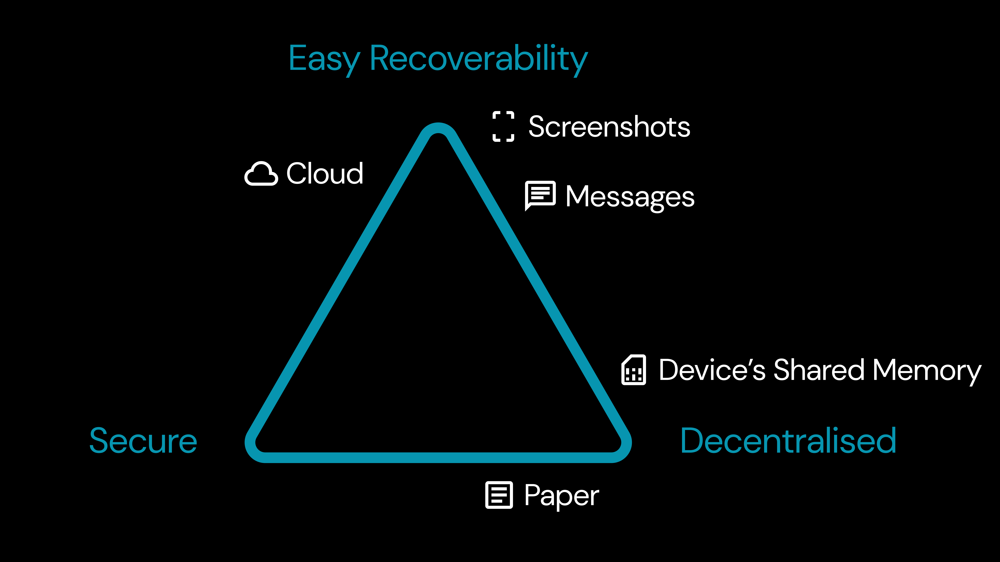

Key management is not only a problem in crypto but also a widespread issue in the digital world, centered around the concept of "ownership." The primary challenge with digital ownership is the lack of a single key management solution that simultaneously provides **recoverability (I)**, **security (II)**, and **decentralization (III)**.

The Clave Application addresses this by combining the most secure key mechanism with the easiest recovery mechanisms, thus ensuring all three properties. For security, Clave utilizes **Passkey Signer**. For recoverability, it employs **Social Recovery** and **Universal Recovery**. These keys are verified on-chain via smart contracts, giving users full control over their assets, ensuring that no one else can access them.

