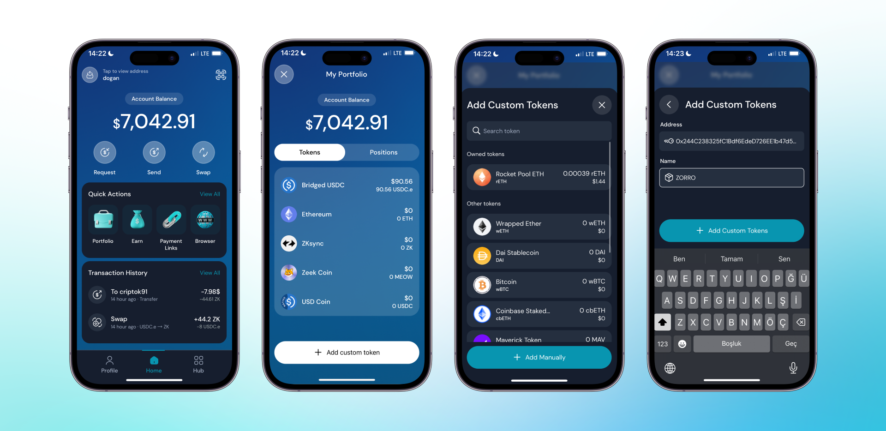

If you want to add custom tokens to track your assets, you have two options. The first option is to find the token by searching its name, and the second option is to copy the token's contract address and paste it into Clave.  Follow these steps to add custom tokens to your Clave wallet:

1. **Open the Clave app** and navigate to the home screen.
2. **Click on "Portfolio"** to view your account balance and tokens.
3. **Scroll down and click on "Add custom token"** at the bottom of the Tokens list.
4. **Search for the token** you want to add. If it appears in the list, select it.
5. If the token does not appear in the list, **click on "Add Manually"**.
6. **Enter the token's contract address** and name.
7. **Click on "Add Custom Token"** to complete the process.

Now that you know how to add custom tokens, you can easily manage all your assets within the Clave app.

