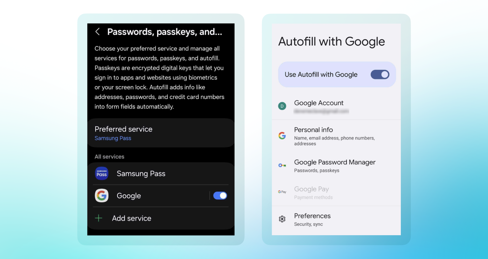
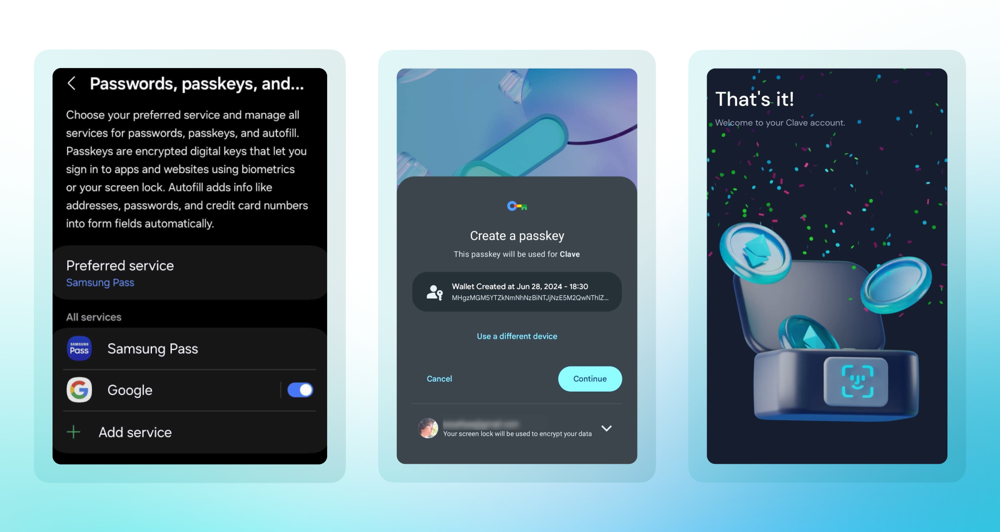

Google Password Manager is a secure tool that allows you to use passkeys for easy and safe access to your accounts. Here's how to set it up:

1. **Open Google Password Manager:** You can select Google Password Manager during the first account creation when you click the 'Create Account' button.
2. **Navigate to Settings:** Go to the settings menu in the Google Password Manager.
3. **Enable Passkeys:** Find and toggle the option to enable passkeys.
4. **Set Up Biometric Authentication:** Follow the on-screen instructions to set up fingerprint or face recognition.

Once configured, you can use your biometric data to quickly and securely access your passwords and accounts.

After that, you can open Clave and create account with just one click! 

1. **Download and Open** Clave Application 
2. Click **Create Account** button
3. Click **Continue**
4. Complete **biometric authentication**

And you're done! You can now enjoy seamless onchain experience with Clave.