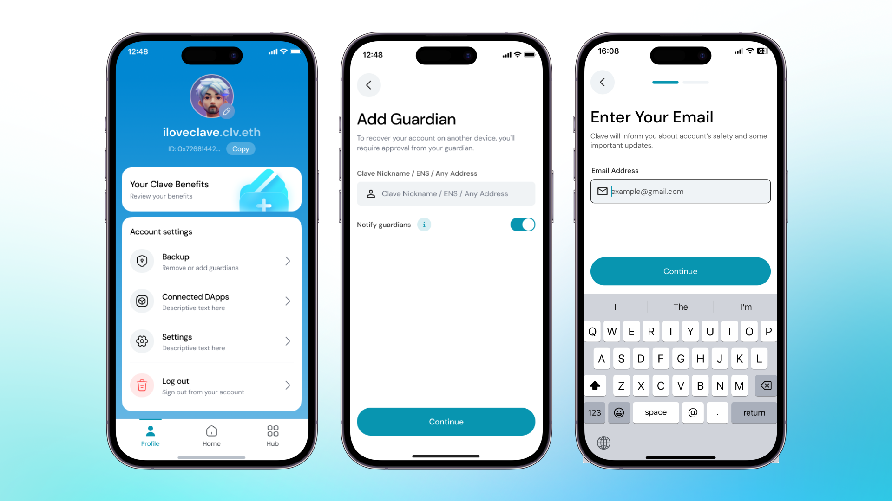

Social recovery allows you to make a family member, a friend, or even your other wallets as guardians for your account. This ensures that even if you lose access to your account, you can recover it securely with the help of your trusted guardians.

To add a guardian, follow these steps:

1. **Open the Clave App** and Navigate to your profile
2. Select **Social Backup**, which will allow you to set up the initial backup process.

3. **Add Guardians** by entering their username, ENS, or 0x address. Guardians can assist you in recovering your account if access is lost. Always ensure you have at least one guardian assigned.

4. **Enter Your Email Address**: Provide your email address to receive notifications about your account's safety and important updates. You will be informed about recovery actions or necessary actions to keep your account secure.

Assigning guardians to your Clave account significantly enhances the security and recoverability of your assets, providing peace of mind knowing that you have trusted individuals or wallets to help you in times of need.
