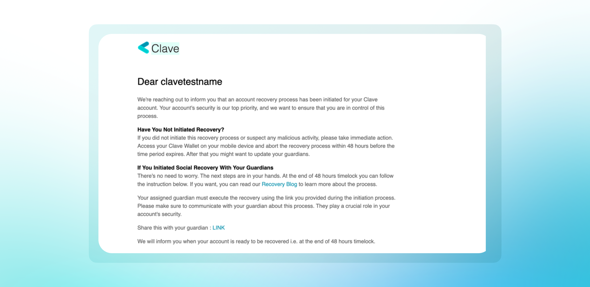
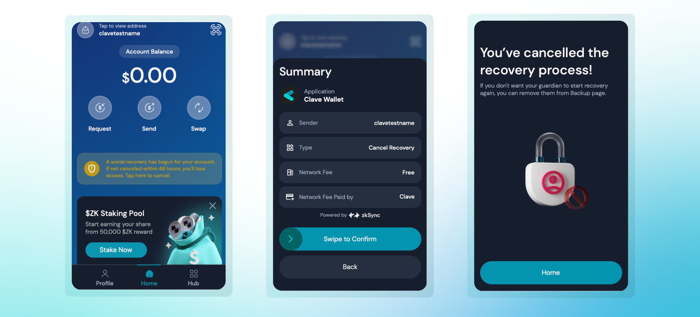

In Clave, social recovery provides a secure way to recover your wallet. If a recovery process is initiated without your consent, you have a 2-day waiting period to cancel the attempt. Here’s how you can cancel a malicious recovery attempt:

1. **Check Your Email and device notifications:** When a recovery process is initiated, you will receive an email notification and an application notification from Clave.

   

2. **Open the Clave App:** On the home screen, you will see a notification indicating that a social recovery has begun for your account. 

3. **Tap on the Notification:** The notification will prompt you to cancel the recovery process within 48 hours.

4. **Cancel the Recovery Process:** Tap on the "Cancel Recovery" button, review the summary and swipe to confirm.
5. **Complete Biometric Authentication** that will pop up to initiate a transaction.
6. **Receive Confirmation:** Once you have successfully canceled the recovery process, you will see a confirmation message.

   

If you suspect that your guardian has been compromised or is acting maliciously, you should remove them from your social recovery setup. To remove a guardian, you should follow the next guide.

