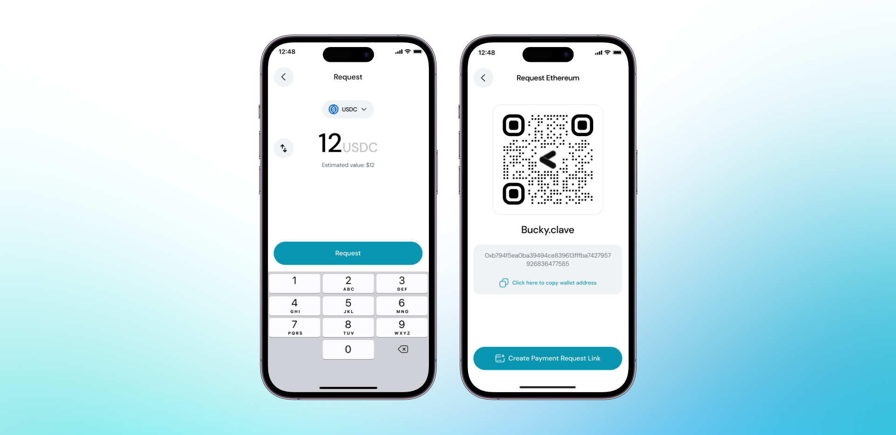

By clicking **“Request”** on the home screen, you can request crypto from other Clave users either via link or QR code.

### Steps to Request Crypto

1. **Open the Clave app** and navigate to the home screen.
2. **Click the Request** button.
3. **Enter the Amount**: Specify the amount and the token you want to request.
4. **Generate Request**: Click on the **"Request"** button to generate a payment request.
5. **Share the QR**: A QR code and your wallet address will be displayed. Share the request by showing the QR code or copying the wallet address.
6. **Share Payment Request Link**: Optionally, create a payment request link to share via messaging platforms.

Now, you can share your link or QR code with others.

