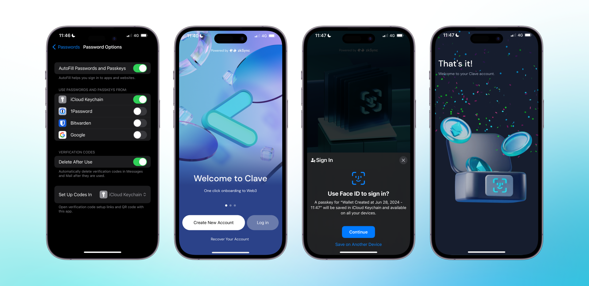

If you are using iCloud Keychain on your iOS device, you should first activate the password account in your settings. 

1. Go to **Settings -> Passwords -> Password Options -> Toggle on “AutoFill Passwords and Passkeys” -> Choose iCloud Keychain**.
2. Open the **Clave app**.
3. Click on **“Create new account.”**
4. You will see the **“Create passkey”** pop-up.
5. Click **continue**, and you created your Clave account!

