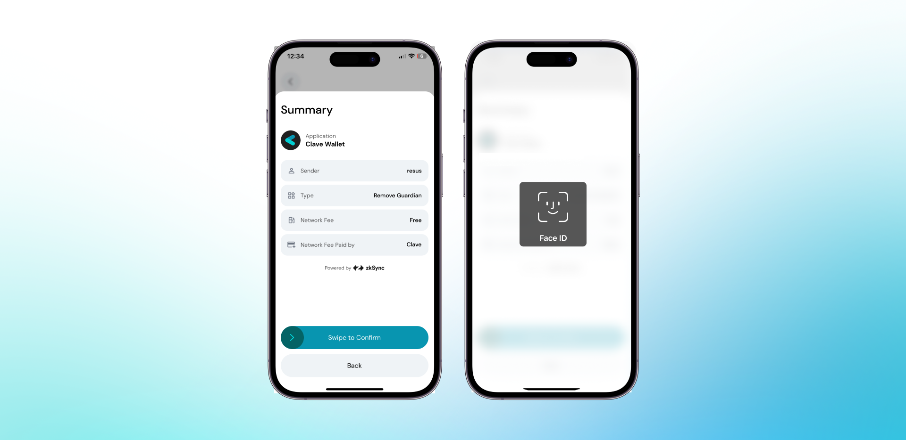

If your guardian is compromised or acting maliciously, you must remove the guardian from your social recovery setup. To remove a guardian, you should follow these steps:

1. **Open the Clave app** and navigate to your profile.
2. **Click on "Social Backup"** to view and manage your guardians.
3. **Swipe Left on the guardian** you wish to remove.
4. **Click the trash icon** next to the guardian's name.
5. **Confirm the removal** by clicking "I understand, remove anyway."

6. **Swipe to confirm** the transaction and authenticate with your biometric ID.
7. **You’ve successfully removed** the guardian from your account.

By following these steps, you can ensure the security of your Clave account and prevent any unauthorized recovery attempts. If you have any concerns, you can always update your guardians for added security.