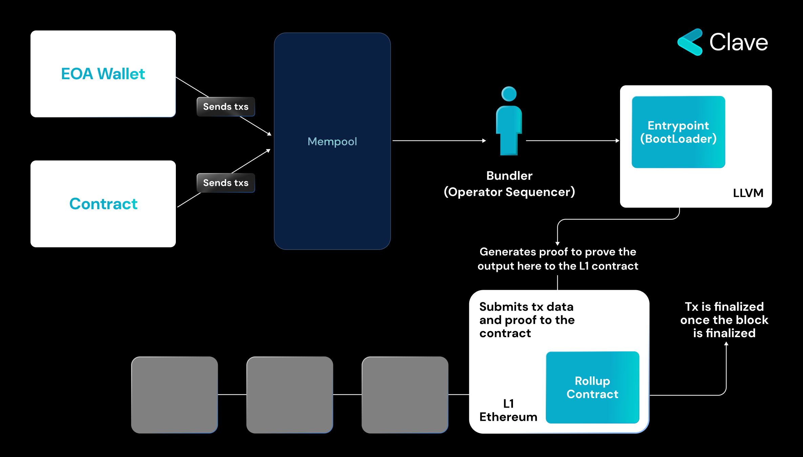

Account Abstraction has been an important dream since Ethereum's inception. It is crucial because the current account model is limited and not programmable. To overcome these limitations, Ethereum developers created Smart Contract-based accounts, also known as Smart Accounts. However, a major challenge with Smart Accounts is that they cannot initiate transactions independently. This is because Smart Contract-based accounts are considered second-class citizens and are not natively supported in Ethereum.

Ethereum core developers have proposed several solutions for Account Abstraction, including EIP-86, EIP-2938, EIP-3074, and EIP-7702. However, each of these proposals required changes to the Ethereum protocol, making their implementation hard. However Ethereum is currently the most economically active blockchain, hosting over $30 billion in locked assets. As such, protocol-level upgrades are rather difficult to implement and take a long time. So much so that "The Merge" could be realized as a result of a 5-year coordination. As such, this is why ERC-4337 AA proposal which does not require protocol changes gained a lot of traction. However, ERC-4337 has a drawback: It requires a lot of extra infrastructure, which makes it hard to scale at massive. And also even with ERC-4337, Smart Accounts remain second class citizens. 

However, Rollups do not face issues like backward compatibility and complex governance processes. Since they are entirely new chains inheriting security from Ethereum, they do not suffer from backward compatibility problems. ZKsync, a ZK rollup on Ethereum, has developed their rollup with native Account Abstraction which is similar to ERC-4337 but natively implemented. Let's explore how it works:

### ZKsync Era's Native Account Abstraction
As mentioned, zkSync has an integration similar to EIP 4337. zkSync is also a ZK-Rollup solution that uses a Sequencer to order and add transactions to the Batch. There are two stages in zkSync Era as in EIP 4337 and Starknet. Here, the EOA and Contract accounts submit transactions to the same mempool. Sharing the same mempool for EOA and Contract accounts enables the paymasters to sponsor the EOA transactions too which is not allowed to do in the original 4337 implementation. So on zkSync Era, you can create a paymaster that sponsors the EOA’s transactions. The Operator (similar to the Bundler in 4337) collects transactions, which then are executed in the EVM via a smart contract called Bootloader (similar to the entrypoint in 4337). Unfortunately, I couldn’t find much information about how the simulation (the off-chain process) is happening on the zkSync, so here is the explainer of what is happening on-chain:

**1. Validation stage where the transaction validity is checked:**

First, the validity of nonce value is checked. (Note: Since nonce integration on zkSync is based on a deterministic order, a wallet can only initiate one transaction at a time. The team is planning to update this in the future.) Operator first calls the validateTransaction function. This function checks the transaction validity, and in case it is valid, it moves to the next stage. In the next stage, the fee of the transaction is paid. There are three different functions that are executed to check whether payment can be received from the Paymaster or directly from the user's wallet. In the final stage of the validation, Bootloader checks if it has received the fee necessary for calling the transaction. 

**2. Transaction execution stage:**

This stage consists of two parts. First, the executeTransaction function is called. Then, if Paymaster is used, the PostOp function is called. This is a function to make it easier for Paymaster to pay fees using ERC20 tokens

