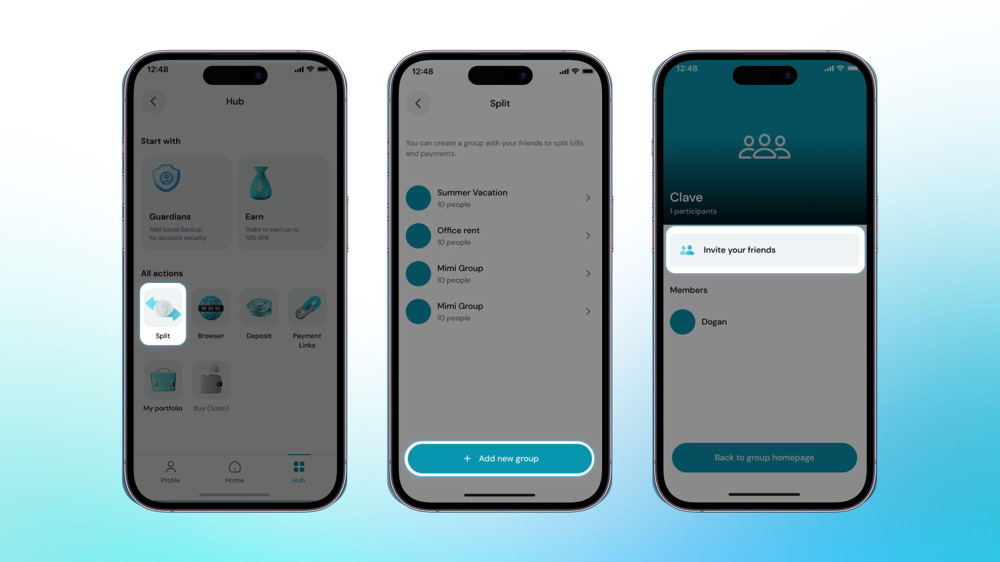

Imagine you're on a trip and want to share expenses with your friends. The Split function in the Clave app makes this easy and hassle-free. Simply create a split group, add your friends, and start sharing costs. Whether it's meals, accommodations, or activities, Clave helps you divide expenses fairly and keeps everything organized. With just a few taps, you can ensure everyone pays their share, making your travel experience smoother and more enjoyable.

Creating a split group and adding friends in the Clave app is simple and efficient. Follow these steps to get started:

1. **Open the Clave App** on your device and navigate to the "Hub" section.

2. **Select the Split Option**: In the Hub, find and select the "Split" icon.

 

3. **Create a New Group** button at the bottom of the screen.

4. **Enter a name for your split group**, such as "Friends Dinner" or "Trip Expenses."

5. **Click on "Invite Your Friends" to add members to your group.** You can invite friends by entering their email addresses or selecting them from your contacts.

  

Congratulations! You have successfully created a split group and added friends. Now, you can easily split bills and manage shared expenses within the Clave app.

Learn how to use Split function at next section ->
