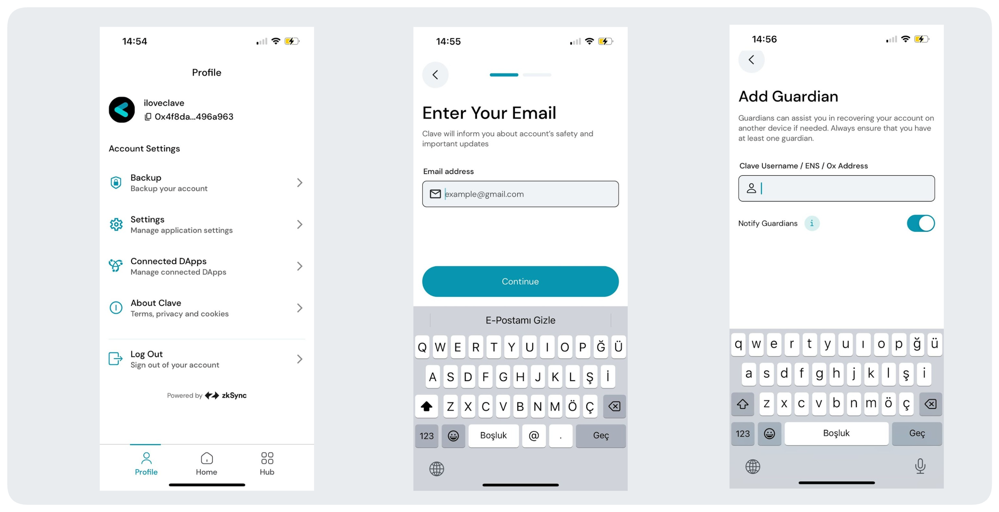

# How to Assign Guardians to Your Clave Account

Social recovery allows you to make a family member, a friend, or even your other wallets as guardians for your account. This ensures that even if you lose access to your account, you can recover it securely with the help of your trusted guardians.

To add a guardian, follow these steps:

1. Go to **Profile** -> **Backup** in your Clave app.
2. First, enter your email address to complete the initial step of the backup process.
3. Then, you can add Clave users or any wallet as your guardian.

### Detailed Steps:

1. **Open the Clave App**: Navigate to your profile and select **Backup your account**.
   - This will allow you to set up the initial backup process, ensuring that your account's safety is prioritized.

2. **Enter Your Email Address**: Provide your email address to receive notifications about your account's safety and important updates.
   - You will be informed about any critical activities or necessary actions to keep your account secure.

3. **Add Guardian**: You can add a Clave user by entering their username, ENS, or 0x address.
   - Guardians can assist you in recovering your account if access is lost. Always ensure you have at least one guardian assigned.

Assigning guardians to your Clave account significantly enhances the security and recoverability of your assets, providing peace of mind knowing that you have trusted individuals or wallets to help you in times of need.
