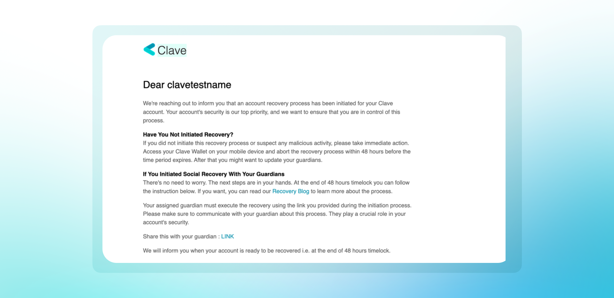
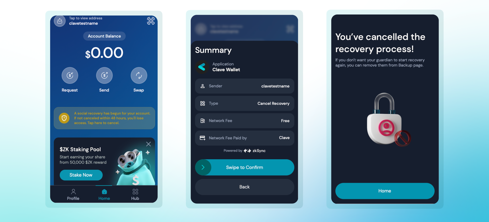
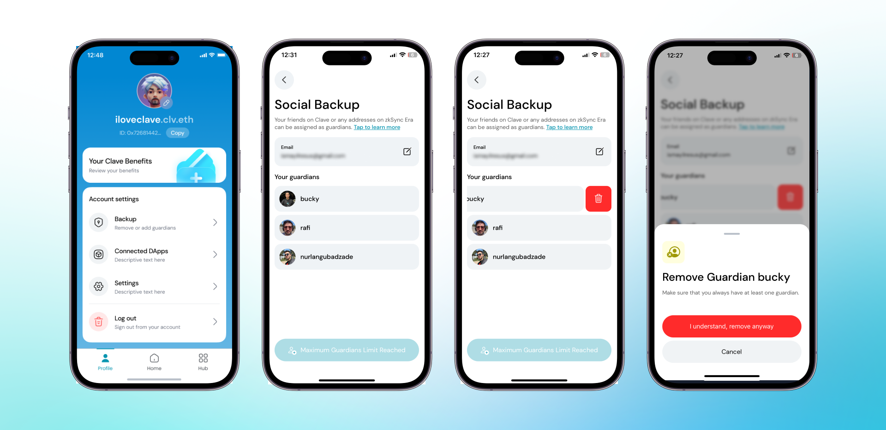

In Clave, social recovery provides a secure way to recover your wallet. If a recovery process is initiated without your consent, you have a 2-day waiting period to cancel the attempt. Here’s how you can cancel a malicious recovery attempt:

1. **Check Your Email and device notifications:** When a recovery process is initiated, you will receive an email notification and an application notification from Clave.

   

2. **Open the Clave App:** On the home screen, you will see a notification indicating that a social recovery has begun for your account. 

3. **Tap on the Notification:** The notification will prompt you to cancel the recovery process within 48 hours.

4. **Cancel the Recovery Process:** Tap on the "Cancel Recovery" button, review the summary and swipe to confirm.
5. **Complate Biometric Authentication** that will pop up to initiate a transaction.
6. **Receive Confirmation:** Once you have successfully canceled the recovery process, you will see a confirmation message.

   

### How to Remove a Guardian

If your guardian is compromised or acting maliciously, you must remove the guardian from your social recovery setup. To remove a guardian, you should follow these steps:

1. **Open the Clave app** and navigate to your profile.
2. **Click on "Social Backup"** to view and manage your guardians.
3. **Swipe Left the guardian** you wish to remove.
4. **Click the trash icon** next to the guardian's name.
5. **Confirm the removal** by clicking "I understand, remove anyway."

6. **Swipe to confirm** the transaction and authenticate with your biometric ID.
7. **You’ve successfully removed** the guardian from your account.

If your guardian is compromised or acting maliciously, you must remove the guardian from your social recovery setup. To remove a guardian, you should follow these steps: 

By following these steps, you can ensure the security of your Clave account and prevent any unauthorized recovery attempts. If you have any concerns, you can always update your guardians for added security.