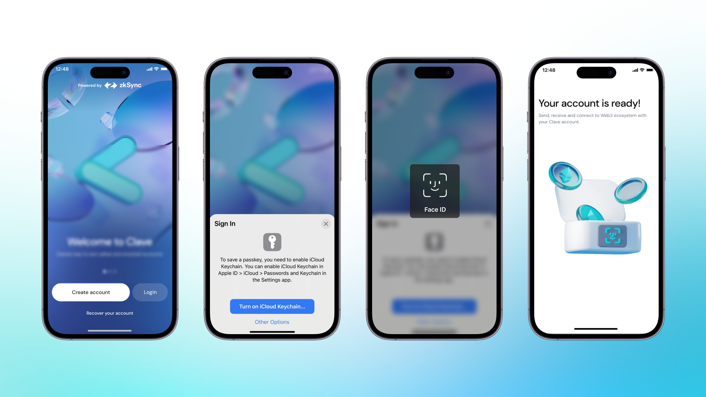
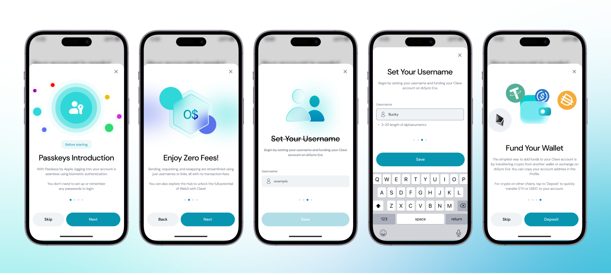
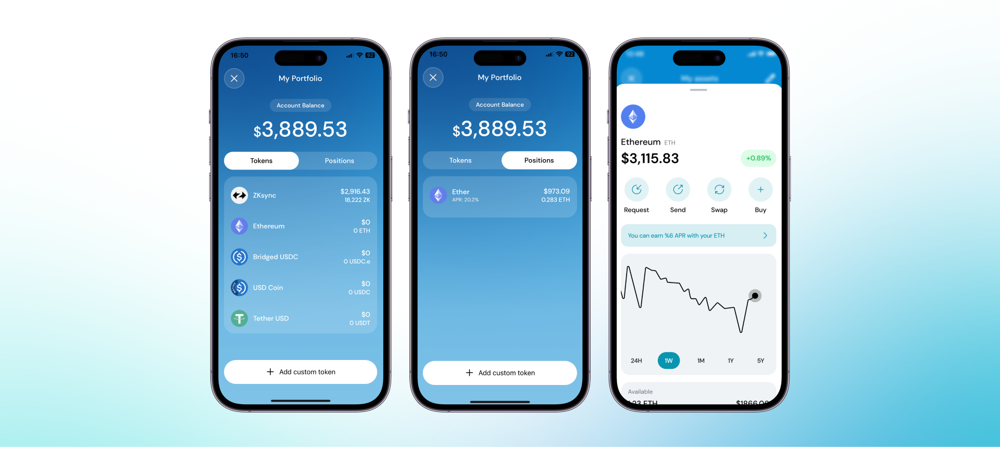

Creating an account with Clave is simple and secure. By using passkeys instead of traditional private keys and seed phrases, Clave provides an easy onboarding process with the highest security standards. Follow our step-by-step guide to set up your new Clave account and start managing your cryptocurrencies with ease.

Clave is a smart wallet that uses passkeys rather than private keys and seed phrases. These technologies are supported by [Apple](https://support.apple.com/en-us/102195?ref=blog2.getclave.io) and [Google](https://support.google.com/accounts/answer/13548313?hl=en&ref=blog2.getclave.io), so Clave uses highly secure encryption techniques to provide users with the highest security and easiest way to control their funds. Thanks to these new improvements, you don’t have to worry about complicated private keys or seed phrases and you can turn your phone into a hardware wallet!

Now, head to the App Store or Google Play Store and [download Clave](http://getclave.io/download?ref=blog2.getclave.io).

After downloading Clave,

1. **Open the app** and click “Create New Account”
2. Sign in via **Face ID**

Voila! You created your account!
If you have a problem with account creation, you can check our [guide](./problem-solving) page for further assistance.

## **Setting Your Account**

Congratulations, you have created your account, and now it's time to set it up!

1. **Passkeys Introduction:** Passkeys enable passwordless account creation with biometric authentication.
2. **Zero Network Fees:** You can enjoy Clave while paying Zero Network Fees. Yes, you read it correctly, transactions are free for Clave users!
3. **Username:** You will be asked to set a username that will match your wallet, so you will not have to worry about a long and complicated wallet address. Your username is the only thing you need in Clave to make your life easier!
4. **Deposit:** If you have cryptos in another wallet or centralized exchange, you can deposit it into your Clave account on ZKsync Era Mainnet by directly sending it to your address. In addition, thanks to our partner Layerswap, you can fund your wallet from different chains in a seamless way!

You created, set, and deposited. Now, you are ready to delve into the forest of DeFi with your Clave wallet.

Enjoy free transactions, seamless UI, and the smoothest experience!

## **Home**

“Home” is a dashboard for your account. You can

- Check your balance,
- Portfolio showing tokens you own,
- See your transaction history,
- Request/Send/Swap crypto easily,
- If you scroll down, you will see your holdings and add custom tokens.

**Now, what?**

You're ready to dive in Clave. Check this tutorial out as next step:
