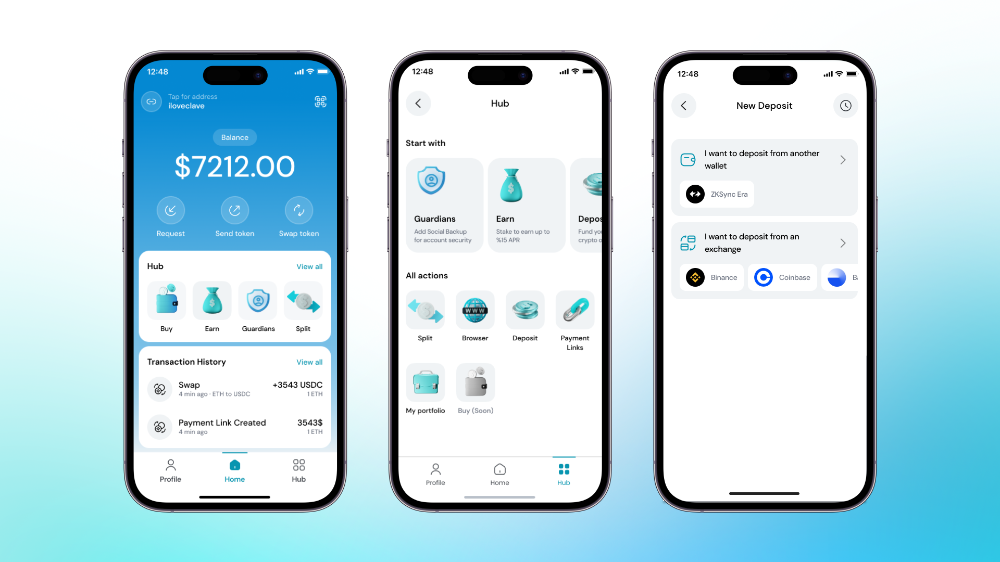
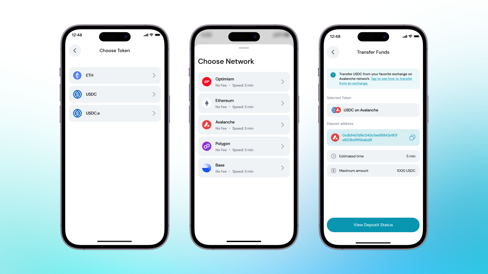

With Clave and Layerswap working together, transferring your crypto assets to ZKsync Era Mainnet has never been more convenient. This powerful partnership ensures that you can deposit funds from any supported blockchain swiftly and cost-effectively.

### To Fund your wallets from other chains, you should follow these steps:

1. Open **Clave**

2. Tap **Hub** to see all actions you can do in Clave including **Deposit**.

3. Tap **Deposit** : Here, you can see all the chains you can send your funds to.

4.. **Select which token** and **how much** you want to deposit.

5.. **Select the network** you have your crypto tokens on other wallets.

6. **Send** on the selected network to **Deposit Address**.
    i. For example, send 1000 USDC on Avalanche to the address provided.
    ii. When the transfer is completed, your tokens will be deposited automatically to your Clave account.
7. **Check deposit status.**
    - You can check the status of your deposit in the "**Pending Deposits**" section.
    - You will receive a notification when your funds arrive in your wallet.
    

Now you are ready to be prepared for ZK Summer. Deposit to your Clave account and be ready!