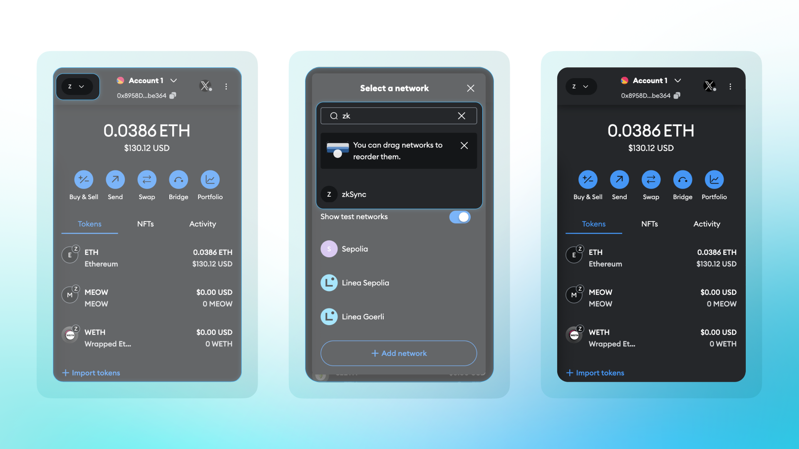
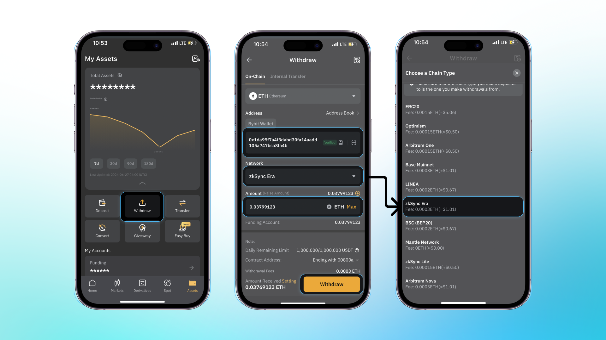

If you haven’t deposited any funds to Clave, no problem! Here is the guide to depositing from CEX’s and other Wallets.

**Getting the Account Address:**
1. First, you need to click the tap to view address button.
2. Then you can copy your account address here, but please remember that you can only deposit funds via **ZKsync Era network.**

**Depositing funds from other wallets:**

1. First, you need to select the **ZKsync Era network.** (This is so important because Clave only works on ZKsync Era.)

2. **Then, you need to click the send button** and paste the copied address.

3. Afterward, you can **select the asset and amount** and send the tokens to Clave accounts.

***Depositing Funds from Cex’s:***

Currently, several centralized exchanges (CEXs), including Binance, OKX, and Bybit, support deposits to Clave. To deposit from these CEXs, they must support zkSync withdrawals.

1. First you need to **select the withdraw button,** then you’ll see the withdraw screen.

2. You should select **ZKsync Era** in the network section and paste the Clave account address you’ve copied.

3. You’re ready to deposit funds to Clave.

We know that these deposit flows are not best, currently working on direct on-ramp solutions to provide a better and seamless deposit experience.