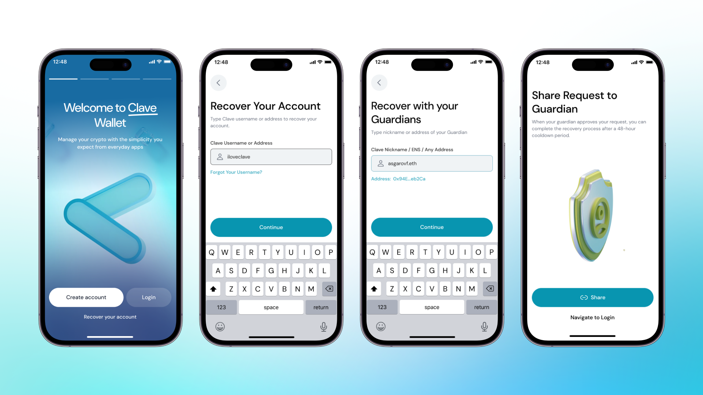

# How to recover your wallet

**Recovery**

Clave uses different recovery mechanisms to ensure your wallet always stays with you.

- **Passkey:** The first one is Passkey, which allows you to recover your account easily through your iCloud.
- **Social Backup:** The other solution is to add guardians as social recovery. If you lose your phone or can’t access your account for different reasons, your guardian may recover your account.

**Recovery with Clave Account**

Normally, in an EOA wallet, if you lose your seed phrases or private keys, there is no way of recovering your account, luckily, there is one in Clave if you assign at least one guardian!

Let's say you lose/change your phone and want to recover your Clave account on another phone. All you have to do is click on the “Recover your account” button when you open Clave and write your and your guardian’s username. After you complete this process, Clave will notify your guardian, or you can share the recovery link with your guardian as well. After your guardian accepts the recovery, the account will be ready for recovery in 48 hours. After 48 hours, you will be able to complete recovery from the same link that is sent to you. We put a 48-hour limit to prevent fraud, and within 48 hours, if the recovery does not come from you, the process can be canceled.

Note: If you are trying to recover your account between two IOS (or two Android) devices, your Passkeys may be accessible through your iCloud or Google Account. If your Passkeys are directly accessible in your new device, we recommend using it instead of social recovery since it gives a direct access to your account without a 48h timelock.