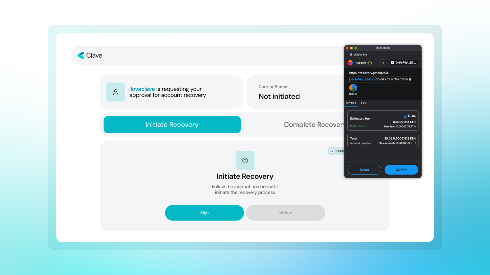

Clave implemented different recovery mekanizms to ensure that users can access their account anytime, while remaining hardware-level-secure.

Your social recovery is not only limited to Clave accounts, you can also assign an EOA wallet (Metamask, Rabby, etc.) of yours to recover your Clave wallet if you need it. The initial process is the same as adding a Clave username, going to Profile - > Backup, pasting your EOA wallet address, and that's all!

The recovery process, however, is a little bit different from that of Clave user guardians.

1. **Click “Recover your account”** on the home page,
2. Write **your Clave username/wallet address**,
3. Write **your guardian’s address (your EOA wallet address),**
4. Clave will create a magic **link for you to start your recovery process,**

5. Go to that link and **connect your wallet,**

6. **Sign and initialize the recovery process** (you need to have some ETH for gas on ZKsync Era Mainnet),

7. **Your recovery process has started** and will be completed in 48 hours!

We put a 48-hour limit to prevent fraud, and within 48 hours, if the recovery does not come from you, the process can be canceled.

8. Now, you can **“Execute” the recovery with your guardian wallet** using the same link that is on [the recovery.getclave.io](http://recovery.getclave.io/) domain.

For mobile phones, it's the same steps and the flow is like this;

Note: Please make sure that you don’t already have access to your account on your device. Your existing passkey will be overridden after requesting recovery from your guardian if you already have access to your account.

Note: If you are trying to recover your account between two IOS (or two Android) devices, your Passkeys may be accessible through your iCloud or Google Account. If your Passkeys are directly accessible in your new device, we recommend using it instead of social recovery since it gives a direct access to your account without a 48h timelock.