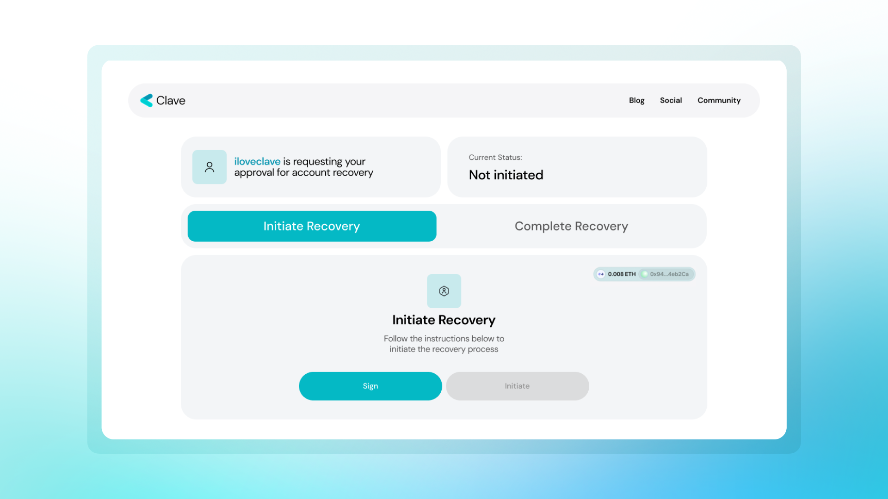
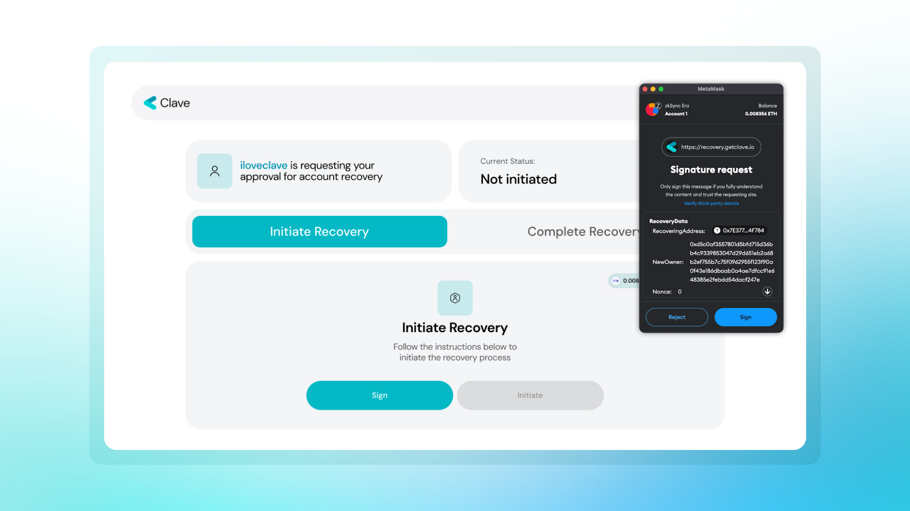
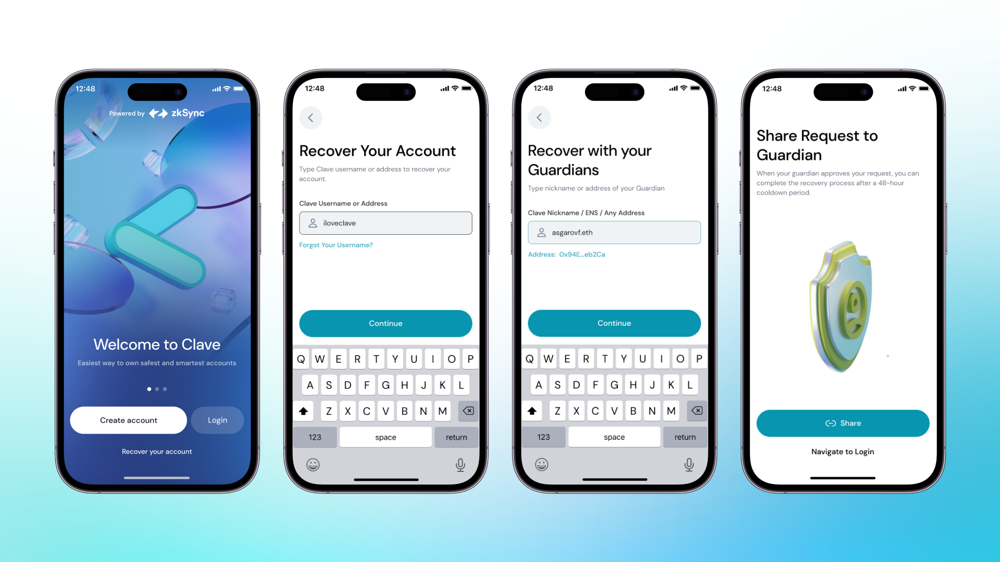
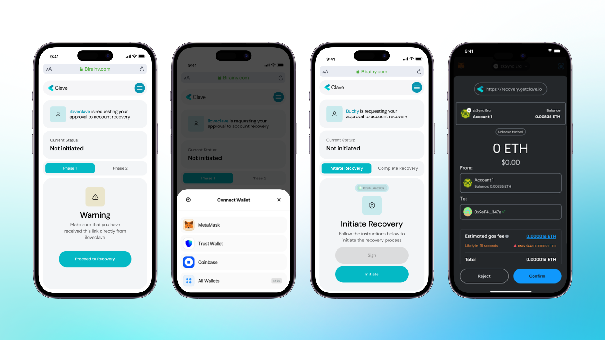

# How to recover your wallet

**Recovery**

Clave uses different recovery mechanisms to ensure your wallet always stays with you.

- **Passkey:** The first one is Passkey, which allows you to recover your account easily through your iCloud.
- **Social Backup:** The other solution is to add guardians as social recovery. If you lose your phone or can’t access your account for different reasons, your guardian may recover your account.

**Recovery with Clave Account**

Normally, in an EOA wallet, if you lose your seed phrases or private keys, there is no way of recovering your account, luckily, there is one in Clave if you assign at least one guardian!

Let's say you lose/change your phone and want to recover your Clave account on another phone. All you have to do is click on the “Recover your account” button when you open Clave and write your and your guardian’s username. After you complete this process, Clave will notify your guardian, or you can share the recovery link with your guardian as well. After your guardian accepts the recovery, the account will be ready for recovery in 48 hours. After 48 hours, you will be able to complete recovery from the same link that is sent to you. We put a 48-hour limit to prevent fraud, and within 48 hours, if the recovery does not come from you, the process can be canceled.

**Recovery with EOA**

Your social recovery is not only limited to Clave accounts, but you can also assign an EOA wallet (Metamask, Rabby, etc.) of yours to recover your Clave wallet if you need it. The initial process is the same as adding a Clave username, going to Profile - > Backup, pasting your EOA wallet address, and that's all!

The recovery process, however, is a little bit different from that of Clave user guardians.

- Click “Recover your account” on the home page,
- Write your Clave username/wallet address,
- Write your guardian’s address (your EOA wallet address),
- Clave will create a magic link for you to start your recovery process,

- Go to that link and connect your wallet,

- Sign and initialize the recovery process (you need to have some ETH for gas on Zksync Era Mainnet),

- Your recovery process has started and will be completed in 48 hours!

We put a 48-hour limit to prevent fraud, and within 48 hours, if the recovery does not come from you, the process can be canceled.

Now, you can “Execute” the recovery with your guardian wallet using the same link that is on [the recovery.getclave.io](http://recovery.getclave.io/) domain.

For mobile phones, it's the same steps and the flow is like this;

Note: Please make sure that you don’t already have access to your account on your device. Your existing passkey will be overridden after requesting recovery from your guardian if you already have access to your account.

Note: If you are trying to recover your account between two IOS (or two Android) devices, your Passkeys may be accessible through your iCloud or Google Account. If your Passkeys are directly accessible in your new device, we recommend using it instead of social recovery since it gives a direct access to your account without a 48h timelock.