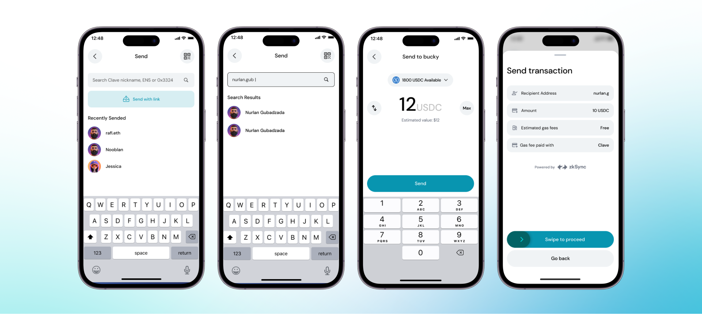
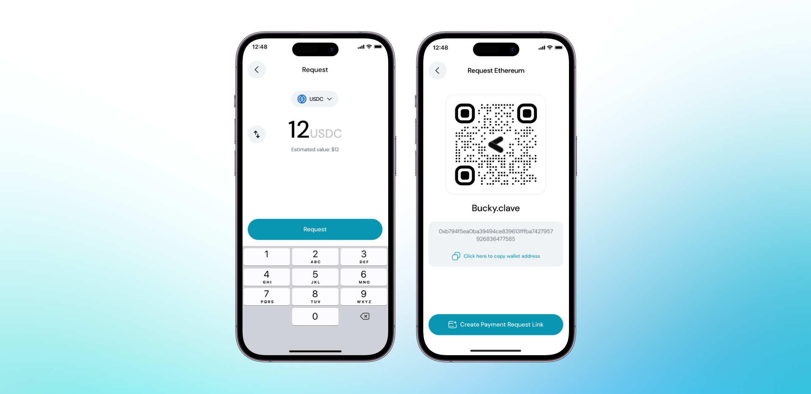

Easiest Way to Send Token, Crypto, and Stables: Clave. Discover how effortlessly you can transfer funds with Clave's user-friendly features. Whether you're sending to a username, creating a magic link, or requesting crypto, Clave simplifies the process and ensures secure transactions. Follow our detailed guide to learn how to make the most of Clave's seamless money transfer capabilities.

By clicking “Send” on the home screen, you can send crypto to anyone seamlessly via Clave.

**a) Send to Clave Username**

This is the most conventional way to send crypto to others. If the person you are sending crypto to already has a Clave account, you can simply write their username and send it. To send money via username, simply follow these steps: 

1. **Open the Clave app** and click on the "Send" button.
2. **Search for the Username,** In the search bar, type the Clave username, ENS, or wallet address of the recipient. If you don’t remember the exact username, you can search for it.

3. **Select the Recipient** from the search results. 

4. **Enter the Amount** of cryptocurrency you wish to send.

5. **Review the Transaction Details** , recipient address, asset and amount.

6. **Send the Crypto:** Click on the "Send" button and swipe to proceed with the transaction and complete biometric authentication.

If the recipient does not use Clave, you can write their ENS and wallet address or scan the QR and send it.

> An extra step might be to convince them to use Clave, and then everything would be much easier for everyone.
> 

**Request**

By clicking “Request” on the home screen, you can request crypto from other Clave users either via link or QR code.

1. **Open the Clave app** and navigate to the home screen of the Clave app.

2. **Click the Request** button

3. **Enter the Amount**: Specify the amount and the token you want to request.

4. **Generate Request** by clicking on the "Request" button to generate a payment request.

5. **Share the QR**: A QR code and your wallet address will be displayed. You can share this request by showing the QR code or copying the wallet address.

6. **Share Payment Request Link**: Optionally, you can create a payment request link to share via messaging platforms.

Now, you can share your link or QR code with others.

