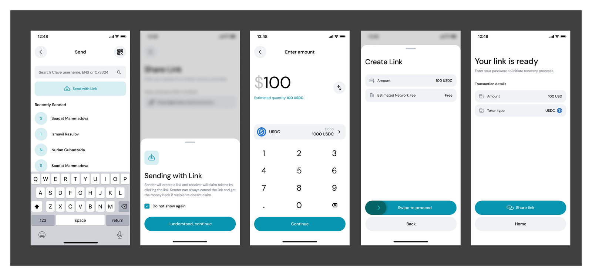

Clave is introducing a new way to send money to literally anyone using payment links, thanks to our smooth integration with [Peanut Protocol](https://peanut.to/?ref=blog2.getclave.io).

<iframe width="560" height="315" src="https://www.youtube.com/embed/Ugjrm0qnMmc" frameborder="0" allow="accelerometer; autoplay; clipboard-write; encrypted-media; gyroscope; picture-in-picture" allowfullscreen></iframe>

*Baki does not need to know Ulas' address to send money!*

Payment links let you send money via any messaging platform (like WhatsApp, Telegram, or Instagram) without needing the recipient's address. This method eliminates the need to know the recipient's account information, and the best part is that the recipient doesn't even need to have a Clave account beforehand, made possible by the infrastructure of the [Peanut Protocol](https://twitter.com/PeanutProtocol?ref=blog2.getclave.io).

To create a payment link, you should follow these steps: 

1. **Open the Clave app** and navigate to the home screen.
2. **Click on "Send"** to begin the process of sending money.
3. **Choose "Send with Link"** from the available options.
4. **Enter the amount** of cryptocurrency you wish to send. You can select the type of cryptocurrency from the list provided.
6. **Confirm the details** and swipe and complete biometric authentication to proceed.
7. **Your payment link is now ready.** You can share this link via any messaging platform, such as WhatsApp, Telegram, or Instagram.

*Send with Links flow inside Clave*

Just send the link, and the recipient can claim the funds with a few simple steps.

### **Payment links offer the flexibility to send money to literally ANYONE!**

You can choose the cryptocurrency you'd like to send, enter the amount, and swipe to confirm.

Voilà! Your magic link is ready to make someone's day. You can also find your unclaimed links in the Hub under "Links."

**Now, [get your Clave account](https://blog.getclave.io/getclave.io/download) to send money to anyone with links!**
