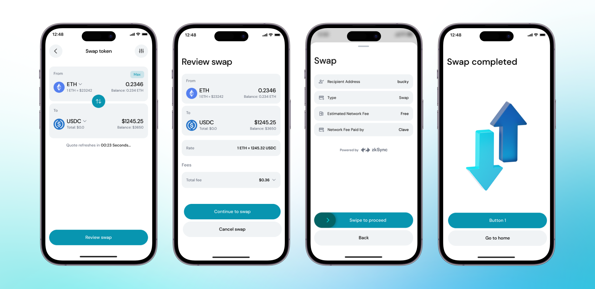

You can easily trade any crypto to another with just a few clicks while you have full custody of your funds. You can buy ETH, BTC, and many others with USDC, USDT, DAI, or any token on ZKsync Era. While trading, you will not see any network fee, so you can *free*ly discover the edges of DeFi.

For now, we are using [Odos Protocol](https://app.odos.xyz/?ref=blog2.getclave.io), one of the best aggregators in the ecosystem, to give you the best quote and route to get you the best price possible. We will add more options in the future.

To swap your tokens, you should follow these steps: 

1. **Open the Clave app** and navigate to the home screen.
2. **Click on "Swap"** to begin the process of exchanging one cryptocurrency for another.
3. **Select the cryptocurrency you want to swap from** by clicking on the "From" section and choosing your desired token (e.g., ETH).
4. **Select the cryptocurrency you want to swap to** by clicking on the "To" section and choosing the desired token (e.g., USDC).
5. **Enter the amount** of the cryptocurrency you wish to swap. The equivalent value in the destination currency will be automatically calculated and displayed.
6. **Click on "Review Swap"** to proceed to the next step.
7. **Confirm the swap details** and swipe to proceed with the transaction. Clave uses ZKsync to power these swaps, ensuring fast and secure transactions with zero fees.

Now that you know the basics, you can swap any crypto with Clave’s built-in Swap function.

