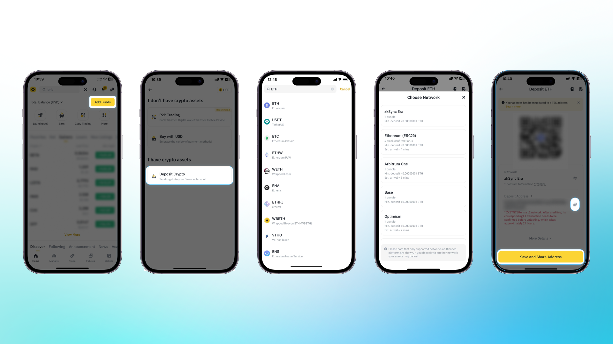
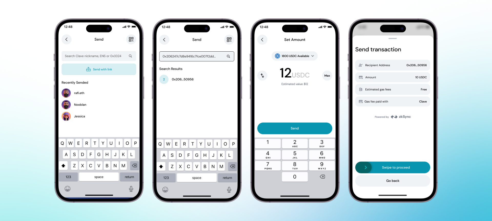

Learn how to withdraw your assets to Centralized Exchanges (CEXs) or other wallets.

1. **Select the token** you wish to withdraw from your wallet.

2. **Select "ZKsync Era"** on chain section and copy the address

3. **Open Clave Application**

4. **Click on the "Send" button** within the Clave app and paste the recipient address you have copied.

5. **Enter the amount of tokens** you want to withdraw.

6. **Complete Biometric Authentication**

Done! You have successfully withdrawn your funds.
