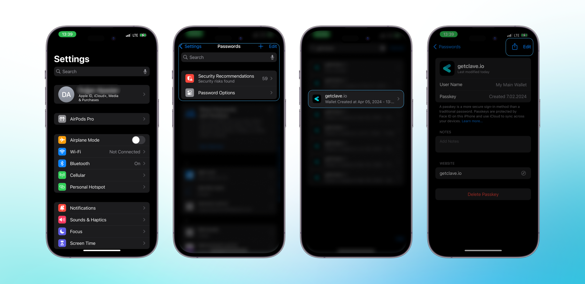

Renaming your Passkey in the Clave app is a straightforward process that allows you to customize and organize your credentials for easier access and management. Follow these steps to rename your Passkey:

1. **Open Settings** on your iOS device.
2. Navigate to **Passwords**.
3. In the Passwords menu, find and tap on **getclave.io**.
4. Tap **Edit** in the upper right corner.
5. Modify the **User Name** field to your preferred name (e.g., "My Main Wallet").
6. Tap **Done** to save your changes.

Now that you know how to rename your Passkey, you can keep your Clave credentials organized and easily accessible.

