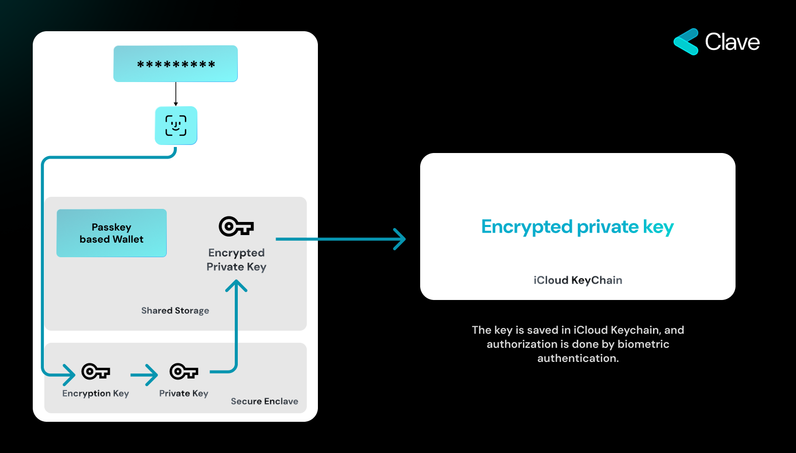

Central to the trustless nature of Web3 is Elliptic Curve Cryptography (ECC). In simple terms, ECC allows users to prove their identity without needing of middleman. It provides strong security while using shorter codes, making it ideal for Web3's decentralized platforms. One of the most evident manifestations of ECC in the Web3 environment is the 12-word mnemonic phrase often required to access a user's account. Instead of relying on the traditional username-password combo, as seen in the Web2 ecosystem, Web3 users are provided with a unique set of 12 words. These words, derived from their cryptographic keys, act as a passphrase to their digital wallets or accounts. This not only revolutionizes the way users prove ownership removing the dependency on centralized entities that was pervasive in Web2.

However, this innovation doesn't come without its challenges. The responsibility of safeguarding these 12 words lies solely with the user. Unlike forgetting a password in a Web2 system, where account recovery might be a click away, losing one's 12-word phrase in the Web3 ecosystem could mean permanent loss of access to one's digital assets and identity. This critical responsibility, though securing user data from centralized breaches, poses a significant barrier to mainstream adoption of Web3. It requires a paradigm shift in user behavior and understanding, as the stakes are considerably higher than misplacing a password.

## Passkeys
As Web3 reshapes the digital landscape, introducing decentralized and trustless operations, there's an emerging need for heightened security measures. Enter the concept of Hardware Sign, an innovative approach that promises to take digital identity verification to new heights.

So, what exactly is Hardware Sign? At its core, Hardware Sign is the principle of using a device's dedicated microchips, like Secure Enclaves, to prove a user's identity. Rather than relying on external servers or online platforms, the authentication process occurs right within your device. Hardware Sign's significance stems from its localized approach to identity verification. By keeping the authentication process confined within the device, it drastically reduces the risk of online breaches or middlemen interference. Furthermore, it leverages the intrinsic security features of modern devices, ensuring that even if a device is lost or stolen, the data within the Secure Enclave remains protected. In the continuously evolving world of digital security, the introduction of the Secure Enclave marks a significant step forward. But what is it, and how does it change the game, especially in the context of Web3?

### Understanding the Secure Enclave

The Secure Enclave is an advanced hardware feature, specifically designed to act as a protective shield around users' most sensitive data. Unlike other parts of a device, which might handle everything from app processes to notifications, the Secure Enclave is a distinct microchip, isolated from all other components of the device. This separation ensures that sensitive data, such as biometric information and cryptographic keys, are isolated from potential threats that might compromise other parts of a device.

Learn [more here](secure-enclave-technical)

### Accessing the Secure Enclave

Another key aspect of the Secure Enclave is its fortified access mechanisms. Data stored within it can only be accessed through either a passcode or biometric authentication methods like Face ID or Touch ID. This adds an extra layer of security, making sure that even if a device falls into the wrong hands, the data within the Secure Enclave remains secure.

### Integrating Secure Enclave into Web3

Perhaps the most groundbreaking feature of the Secure Enclave, especially in the realm of Web3, is its support for Elliptic Curve Cryptography (ECC). This means that the Secure Enclave can generate and manage cryptographic key pairs, crucial for digital transactions and identity verification in the Web3 ecosystem.

Even more impressive is the capability of the Secure Enclave to sign messages using the internally generated key, without ever allowing the extraction of the key from its confines. In practical terms, this ensures the highest level of data security, as the key never leaves the safety of the Secure Enclave, eliminating potential points of vulnerability.

For Web3 users, this has profound implications. Instead of remembering a 12-word mnemonic phrase to access their accounts — a cumbersome process for many — users can simply use their biometric data. When a user employs, say, their fingerprint via Touch ID, the Secure Enclave verifies the biometric data, signs the necessary cryptographic messages internally, and grants access. This seamless process not only enhances security but also provides an intuitive and user-friendly experience.

## Our Key Management Approach

At the core of our approach is the utilization of Secure Enclaves. The cryptographic key, essential for your transactions, is generated within this enclave and importantly, it never leaves its confines. This encapsulation ensures the key's security even during transaction processes.

### The Key Creation Process

The journey starts when a user decides to generate a cryptographic key pair. Here's how it unfolds:

1. Biometric Authentication: The user initiates the key generation process by providing biometric authentication, such as a fingerprint or facial recognition. This step ensures that only the genuine user can authorize the creation of a key pair within the Secure Enclave.
2. Internal Key Generation: Post authentication, the Secure Enclave creates the cryptographic key pair. The essential factor to note here is that the generated key remains within the Secure Enclave, never venturing outside, ensuring its absolute security.

### The Transaction Process

Once the key is securely generated, it can be used to sign messages, a fundemental step for initiating transactions in the Web3 world. The process is straightforward yet robust:

1. Initiating the Signing Process: When a user wishes to make a transaction, the app takes the required message and forwards a signing request to the Secure Enclave.
2. Biometric Authentication for Signing: To confirm the signing request, the user provides biometric authentication once again. This step ensures that only the authorized user can approve the signing of a message using the stored key.
3. Internal Message Signing: The Secure Enclave, upon receiving user authorization, signs the message with key that created inside the Secure Enclave.
4. Ready for the Blockchain: The signed message is now in a transaction format, primed and ready to be recorded on the blockchain.

<Accordion title="What If The User Loses The Device?">
  A genuine concern, but there's a silver lining. With Secure Enclave, even if your device falls into the wrong hands, accessing sensitive information is next to impossible. But how do you recover your account? We’ll be diving into our recovery approach in the [Recovery Section]("recovery").
</Accordion>

