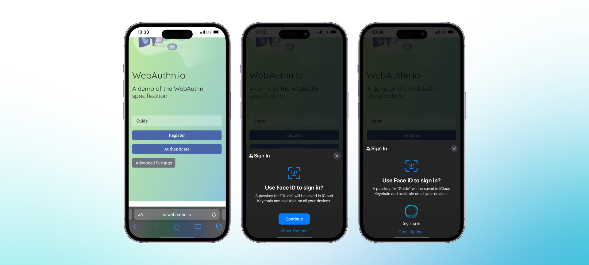
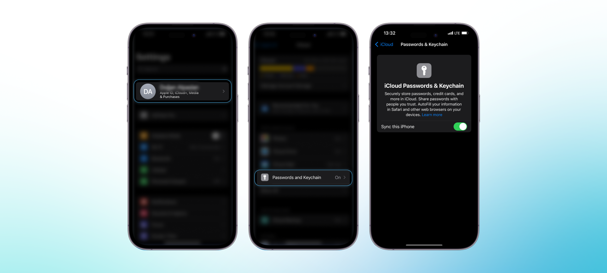
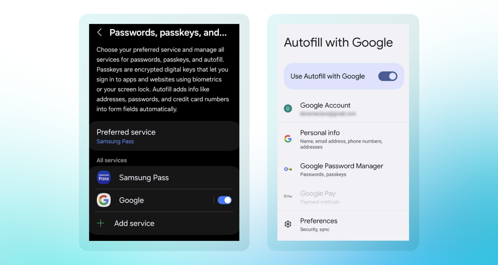

**1. I cannot create an account.**

If you have an Android phone, please note that there are some bugs with Android phones such as some Android 14 devices, Samsung Ultra models, OnePlus, etc. Since Passkey is a pretty new technology, it might not be optimized for all Android devices.

First, check whether your phone has Passkey support. To do so:

1. Go to **[webauthn.io](https://webauthn.io)**
2. **Put a dummy text** on the input box and click "Register"
3. **You should see that a passkey is generated.** See images below (left is for Android, right is for iPhone):

**2. I’m using an iPhone and have a problem creating my account.**

Please check the following settings first. If the problem persists, join Clave Discord and open a Support ticket.

1. **Check the iOS version.** To activate Passkeys, your software version should be iOS 16 or macOS 13 or higher.

    Go to **Settings → General → About** to check the iOS version. If your iOS version is older than iOS 16, update it under **Settings → General → Software Update**.

2. **Turn on iCloud Passwords & Keychain Sync.**

    Go to **Settings → Apple ID → iCloud → Passwords and Keychain** and enable “Sync this iPhone”. 

    Although the sync is already enabled, sometimes disabling and re-enabling is required to activate it.

3. **Turn on AutoFill Passwords and Passkeys.**

    Go to **Settings → Passwords → Password Options**

    Enable AutoFill Passwords and Passkeys.

    Enable iCloud Keychain in "Use Passwords and Passkeys From" section.

**3. I’m using an Android Phone and have a problem creating my account.**

For Android phones, there is no single way to manage Passkey settings. However, in general, you can follow these methods. If these are not working for you, you can search “Passkey” in your device settings. You can also take a look at [our guides](android-users) for android devices 

**First Method** (Works with Samsung)

1. Go to **Settings → General Management → Passwords Passkeys and Autofill** and enable Google autofill option.
2. Depending on your passkey provider (i.e., Samsung Pass or Google), **you can change Preferred Service.** We suggest using Google services with Clave.

**Second Method** (Works with Xiaomi)

1. Go to **Settings → (Accounts) → Google → Password Manager** and enable "Use Autofill with Google".

**4. I set up my account but my transactions always fail.**

Make sure that you have the latest version of Clave. Visit [getclave.io/download](https://getclave.io/download) to check it.

**5. I lost/changed my phone. How can I recover my wallet?**

See our [Recovery](how-to-recover-clave) page. If you cannot start the recovery process, contact us on Discord.
