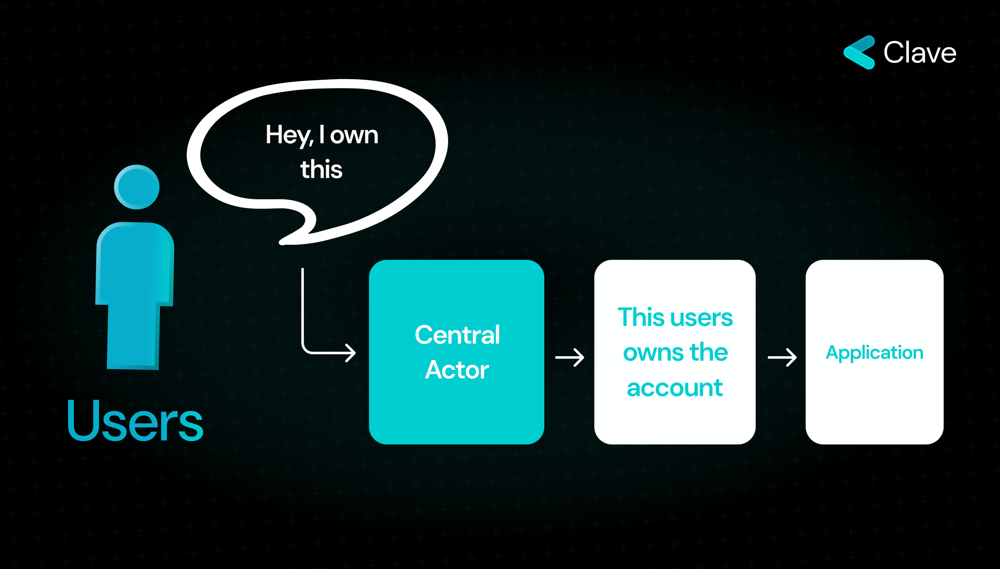
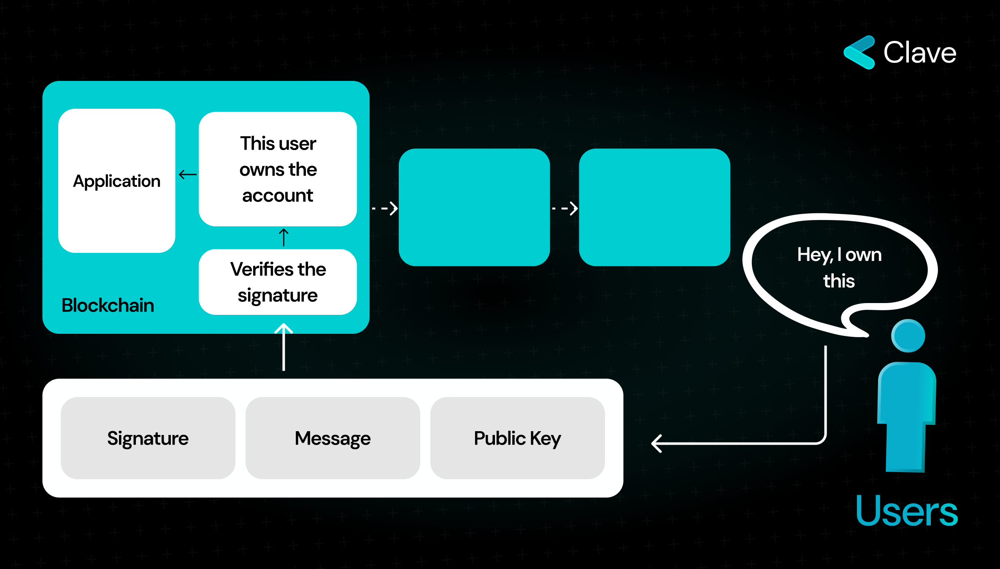

Almost all modern devices have two primary components: **an operating system** (with associated shared storage) and a **Secure Enclave.** The operating system handles most operations except for sensitive tasks like protecting biometric data, cryptographic keys, encryption, and device unlocking.

Developers created a dedicated microchip called the Secure Enclave to manage these sensitive operations separately. The Secure Enclave functions similarly to a hardware wallet; it operates independently, securely handling sensitive data, and even the device owner cannot access its contents. Fortunately, the Secure Enclave supports cryptographic operations, such as creating private keys and signing messages with them. The Secure Enclave includes several key features that make it a secure place to store data.

**Secure Enclave is Isolated:** The Secure Enclave operates independently from the main processor, ensuring that sensitive operations, such as protecting biometric data and cryptographic keys, are handled in a secure environment that is not accessible to other parts of the system.

**Secure Enclave Has a Dedicated Microprocessor:** The Secure Enclave has its own microprocessor running an Apple-customized version of the L4 microkernel. This microprocessor is dedicated solely to secure operations, providing strong isolation and preventing attack vectors.

**Secure Enclave Has a Memory Protection:** The Secure Enclave uses a dedicated region of the device’s DRAM memory with multiple layers of protection. This includes encryption and authentication mechanisms to ensure that the data remains secure even if the memory is accessed.

**Secure Enclave Has a Secure Boot:** The Secure Enclave includes a dedicated Secure Enclave Boot ROM, establishing a hardware root of trust. During startup, the Secure Enclave Boot ROM initializes the memory protection and verifies the software's cryptographic integrity, ensuring that only authorized software can execute.

**Secure Enclave Can Make Cryptographic Operations:** The Secure Enclave supports various cryptographic operations, including key generation and signing. This means that private keys can be generated and used for cryptographic operations within the Secure Enclave, without exposing them to the rest of the system.These features make the Secure Enclave hardware level secure. So, wait; What Does Hardware Security Mean? Hardware level security refers an Isolated, Memory Protected, Tamper Resistant security. And as you can see, Secure Enclave supports it.

Clave utilize Secure Enclave with Passkeys, which is an authentication mechanism that use Secure Enclave to store private keys and sign messages securely. This enables Clave to achieve one click onboarding with hardware level security.

## What are The Differences Between Clave, Hot Wallets and Hardware Wallets?

We’ve launched Clave with a clear vision: to transform your everyday devices into a secure hardware wallet. Clave is now live, boasting passkey-based authentication and is ready for mass adoption. But the question remains: does Clave truly offer the security of a hardware wallet? Let's delve into this.

### Private Key Creation

**Hardware Wallets:** These wallets generate private keys internally within the device itself. The keys are never exposed to the operating system (OS), safeguarding them even if the device is compromised.

**Hot Wallets:** Conversely, hot wallets generate keys directly on the OS, making them vulnerable if the device is compromised.

**Clave (Consumer-TEE Based Wallets):** Like a hardware wallet, Clave generates keys within the secure enclave of the hardware, ensuring they are never exposed to the Operating System.

### Key Storage

**Hardware Wallets:** Keys are stored within the device and are not accessible through the Operating System.

**Hot Wallets:** Keys are stored on the OS, which poses risks if the device security is breached.

**Clave (Consumer-TEE Based Wallets):** Keys are encrypted in the secure enclave (SE), and the encrypted version is stored in the Operating System. This method mirrors the security protocols of hardware wallets. And no one can access the keys.

### Transaction Signing

**Hardware Wallets with Displays:** Users rely on the device’s display, which is considered secure and can only be updated through firmware updates.

**Hardware Wallets with no Display:** Users rely on the wallet software to show what they sign, similar to hot wallets.

**Hot Wallets:** Users must trust the wallet's software to display transaction details for signing accurately.

**Clave (Consumer-TEE Based Wallets):** Clave operates through a mobile app, requiring users to trust the app to display what they are signing. Although this is similar to hot wallets, it’s important to note that the difference between Clave and traditional hardware wallets is minimal because hardware wallet firmware updates are similar to Clave’s app updates.

Look at the Clave's onboarding flow which is powered by Passkeys:
<iframe
  width="860"
  height="500"
  src="https://www.youtube.com/embed/aM8x2qE3tgU?si=KTcvzeoYTUIZiJXK"
  title="YouTube video player"
  frameborder="0"
  allow="accelerometer; autoplay; clipboard-write; encrypted-media; gyroscope; picture-in-picture"
  allowfullscreen
></iframe>

