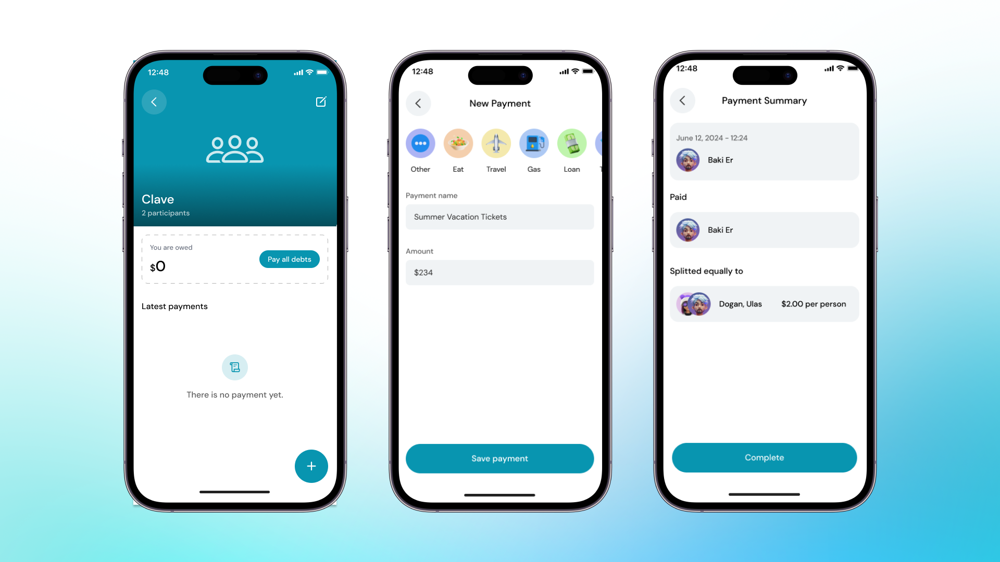

Managing shared expenses with your friends has never been easier. Here’s how you can add payments to your split group using the Clave app:

1. **Open the Clave App**:
   Launch the Clave app on your device and navigate to your split group.

2. **Select the Group**:
   Choose the split group you want to add a payment to.

3. **Add a Payment**:
   Click on the "Add Payment" button at the bottom of the screen.

4. **Enter Payment Details**:
   - **Category**: Select the category of the expense (e.g., Eat, Travel, Ticket, Loan).
   - **Name**: Enter a description of the expense (e.g., Pizza).
   - **Amount**: Enter the amount of the expense.

5. **Proceed and Confirm**:
   Click "Proceed" to review the payment details. Ensure that the payment information is correct.

7. **Complete the Process**:
   Click "Complete" to finalize the payment addition. The expense is now recorded, and the amount is split equally among the group members.
    

Congratulations! You have successfully added a payment to your split group. This keeps all your shared expenses organized and ensures everyone knows their share of the costs.

To learn how to pay your debts, read next guide ->