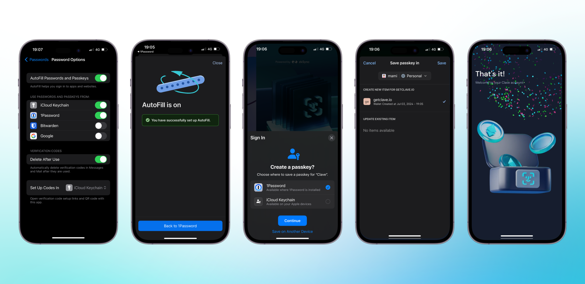

Eğer iOS veya Android cihazınızda Bitwarden kullanıyorsanız, öncelikle ayarlarınıza başka bir şifre hesabı eklemeniz gerekir.

- Eğer bir iOS cihazı kullanıyorsanız, **Ayarlar -> Şifreler -> Şifre Seçenekleri -> 1Password Ekle** yolunu izleyin.
- Eğer bir Android cihazı kullanıyorsanız, **Ayarlar -> Şifreler -> Şifreler ve Otomatik Doldurma -> 1Password Ekle** yolunu izleyin.

1. Ardından **Clave uygulamasını** açın.
2. **“Yeni hesap oluştur”** seçeneğine tıklayın.
3. **“Passkey oluştur”** pop-up'ını göreceksiniz.
4. Passkey seçeneği olarak **1Password**'u seçin.
5. **devam** butonuna tıklayın ve Clave hesabınızı oluşturdunuz!

