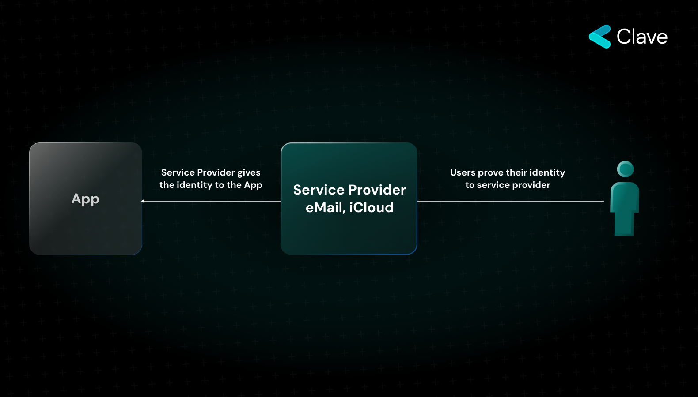
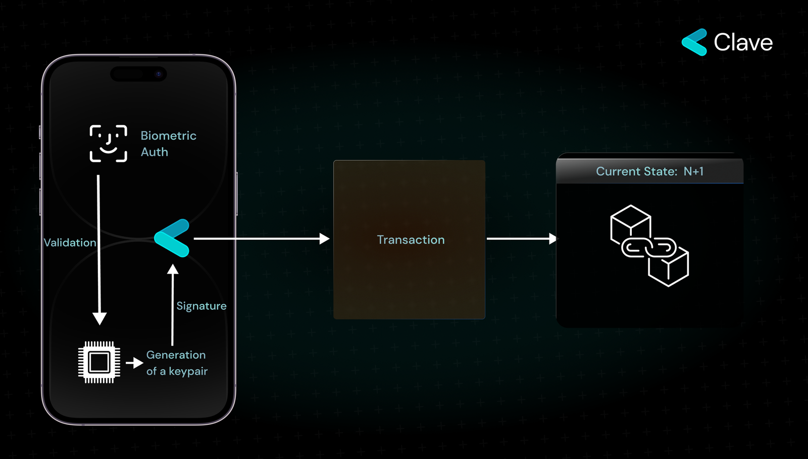

## Dijital Çağda Sahipliği Anlamak: Web2 ile Web3'ün karşılaştırılması & Passkey Imzacısının Rolü

İnternetteki 'sahiplik' kavramı, özellikle Web2'den Web3'e geçişle birlikte yıllar içinde dramatik bir şekilde değişti. Haydi, bu dönüşümü inceleyelim ve Secure Enclave gibi ileri teknolojilerin dijital kimlik ve güvenlik anlayışımızı nasıl yeniden şekillendirdiğini tartışalım.

### Web2'de Sahiplik

İnternetin ikinci evresi olan Web2, esas olarak kullanıcı tarafından oluşturulan içerik ve sosyal medya platformlarının yükselişine odaklanır. Web2 çağında, dijital mülkiyet büyük ölçüde merkezi, hizmet sağlayıcı odaklı bir model üzerinden işler. İşleyiş genellikle şu şekildedir:

- Kullanıcılar, iCloud veya Gmail gibi bir hizmet sağlayıcıya hesaplarına sahip olduklarına ilişkin kanıt sunarlar (genelde şifre ve kullanıcı adını girerek).
- Hizmet sağlayıcısı, kullanıcının kimliğini doğrular.
- Kimlik doğrulandıktan sonra, bu kimliğe sahip olduğu bilgisi kullanıcının erişmek istediği çeşitli uygulamalara veya platformlara iletilir.

Bu merkezi modelin önemli bir avantajı vardır: Kullanıcıların hesaplarını kolayca kurtarabilmeleri ve hesaplarına kolayca erişmelerinin kolaylığı. Ancak, bu kolaylık bir dezavantajla gelir. Tüm sistem, aracı olan hizmet sağlayıcısının güvenilirliğine dayanır. Bu önemli güven varsayımı, Web3'te görülen merkeziyetsiz, kriptografik anahtar tabanlı kimlik doğrulama modeline geçişi teşvik eder.

### Web3'te Sahiplik: Merkeziyetsiz, Matematiğe Dayanan Paradigma

Dijital dünyanın evriminde, Web3 internetteki sahipliğin özünü yeniden tanımlamayı amaçlayan bir devrim olarak karşımıza çıkıyor. Temelde, Web3 herhangi bir aracıya güvene ihtiyaç duymadan çalışacak şekilde tasarlanmıştır, yani kullanıcılar çevrimiçi sahipliklerini veya kimliklerini doğrulamak için üçüncü taraf aracılara veya "aracılara" güvenmek zorunda kalmamalıdır.

Web3'ün matematiğe dayanan doğasının merkezinde Eliptik Eğri Kriptografisi (ECC) yer alır. ECC, kullanıcıların kimliklerini bir aracıya ihtiyaç duymadan kanıtlamalarına olanak tanır. Web3 ortamında ECC'nin en belirgin tezahürlerinden biri, bir kullanıcının hesabına erişmek için genellikle gereken 12 kelimelik anımsatıcı cümledir. Bu kelimeler, kriptografik anahtarlarından türetilir ve dijital cüzdanlarına veya hesaplarına erişim sağlamak için bir parola görevi görür.

Ancak, bu yenilik zorlukları beraberinde getirir. Bu 12 kelimeyi koruma sorumluluğu tamamen kullanıcıya aittir. Web3 ekosisteminde birinin 12 kelimelik cümlesini kaybetmesi, dijital varlıklarına ve kimliğine kalıcı olarak erişimini kaybettiği anlamına gelir.

### Web3'te Kimliği Kanıtlama İçin Yeni Bir Paradigma: Özel Donanım ile Güvenli İmza - Passkey

Web3, merkeziyetsiz ve güvensiz operasyonları tanıtırken dijital manzarayı yeniden şekillendirirken, gelişmiş güvenlik önlemleri için artan bir ihtiyaç doğuyor. İşte bu noktada, dijital kimlik doğrulamasını yeni zirvelere taşımayı vaat eden yenilikçi bir yaklaşım olan Donanım İmzası kavramı devreye giriyor. Donanım (veya bir başka deyişle Passkey) imzasının ana özelliği, güvenliğini Secure Enclave denen özel bir donanımdan almasıdır.

#### Secure Enclave'ı Anlamak

Secure Enclave, kullanıcıların en hassas verilerini korumak için özel olarak tasarlanmış gelişmiş özel bir işlemcidir. Bir cihazın diğer bölümleri, uygulama süreçlerinden bildirimlere kadar her şeyi işleyebilirken, Secure Enclave, cihazın diğer bileşenlerinden izole edilmiş ayrı bir mikroçiptir. Bu ayrım, biyometrik bilgiler ve kriptografik anahtarlar gibi hassas verilerin potansiyel tehditlerden izole edilmesini sağlar ve neredeyse bütün modern cihazlarda bulunur. 

#### Secure Enclave'a Erişim

Secure Enclave içinde saklanan verilere yalnızca bir şifre veya Face ID ya da Touch ID gibi biyometrik kimlik doğrulama yöntemleriyle erişilebilir. Bu, cihaz kaybolsa veya çalınsa bile Secure Enclave içindeki verilerin korunmasını sağlayarak ek bir güvenlik katmanı ekler.

### Secure Enclave'ı Web3'e Entegre Etmek

Özellikle Web3 alanında, Secure Enclave'ın en yenilikçi özelliklerinden biri Eliptik Eğri Kriptografisi (ECC) desteğidir. Bu, Secure Enclave'ın kriptografik anahtar çiftlerini oluşturabileceği ve yönetebileceği anlamına gelir, bu da Web3 ekosisteminde dijital işlemler ve kimlik doğrulama için çok önemlidir.

Daha da etkileyici olan, Secure Enclave'ın içsel olarak oluşturulan anahtarı, anahtarın Secure Enclave'den çıkarılmasına izin vermeden mesajları imzalama yeteneğidir. Web3 kullanıcıları için bu derin etkiler taşır. Hesaplarına erişmek için 12 kelimelik bir anımsatıcı cümleyi hatırlamak yerine, kullanıcılar sadece biyometrik verileriyle işlemler imzalayabilir ve giriş yapabilir.

### Anahtar Saklama Yaklaşımımız

#### Secure Enclave ile Anahtar Yönetim Sistemimiz

Yaklaşımımızın merkezinde Secure Enclave'ın kullanımı yer alır. İşlemleriniz için gerekli olan kriptografik anahtar, bu enclave içinde oluşturulur ve önemlisi, asla bu sınırların dışına çıkmaz. Bu mekanizma, anahtarın işlem süreçleri sırasında bile güvenliğini sağlar, cihazınız çalınsa, hacklense dahi anahtarlarınızın güvende kalmasını sağlar.

#### Anahtar Oluşturma Süreci

Süreç, bir kullanıcı kriptografik anahtar çifti oluşturmaya çalıştığında başlar:

1. **Biyometrik Kimlik Doğrulama**: Kullanıcı, parmak izi veya yüz tanıma gibi biyometrik kimlik doğrulama sağlayarak anahtar oluşturma sürecini başlatır.
2. **Anahtar Oluşturma**: Kimlik doğrulamanın ardından, Secure Enclave kriptografik anahtar çiftini oluşturur. Oluşturulan anahtar Secure Enclave içinde kalır ve asla dışarı çıkmaz, bu da onun mutlak güvenliğini sağlar.

#### İşlem Imzalama Süreci

Anahtar güvenli bir şekilde oluşturulduktan sonra, Web3 dünyasında işlemleri başlatmak için temel bir adım olan mesajları imzalamak için kullanılabilir:

1. **İmzalama Sürecini Başlatma**: Kullanıcı bir işlem yapmak istediğinde, uygulama gerekli mesajı alır ve bir imzalama isteğini Secure Enclave'a iletir.
2. **İmzalama İçin Biyometrik Kimlik Doğrulama**: İmzalama isteğini onaylamak için kullanıcı tekrar biyometrik kimlik doğrulama sağlar.
3. **İçsel Mesaj İmzalama**: Secure Enclave, kullanıcı yetkilendirmesini aldıktan sonra mesajı Secure Enclave içinde oluşturulan anahtar ile imzalar.
4. **Blokzincir İçin Hazır**: İmzalanan mesaj, şimdi blokzincirde kaydedilmeye hazır bir işlem formatındadır.

### Kullanıcı Cihazını Kaybederse Ne Olur?

Secure Enclave ile, cihazınız yanlış ellere düşse bile hassas bilgilere erişmek neredeyse imkansızdır. Hesabınızı kurtarmak mümkündür ve  bir sonraki bölümde kurtarma yaklaşımımıza değineceğiz.
