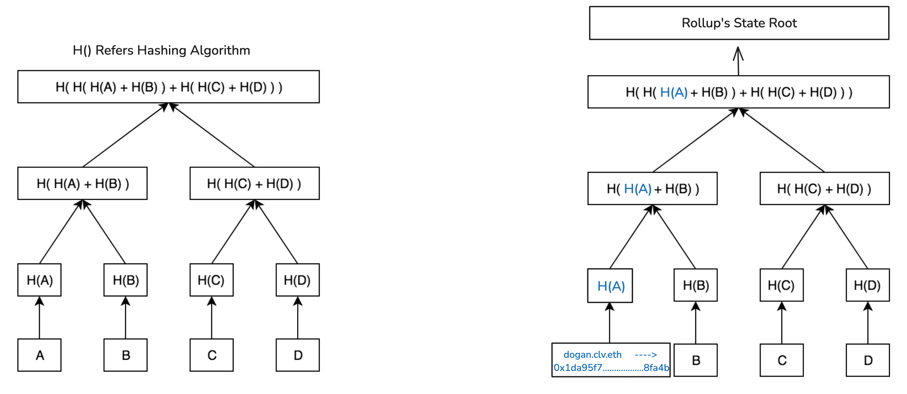
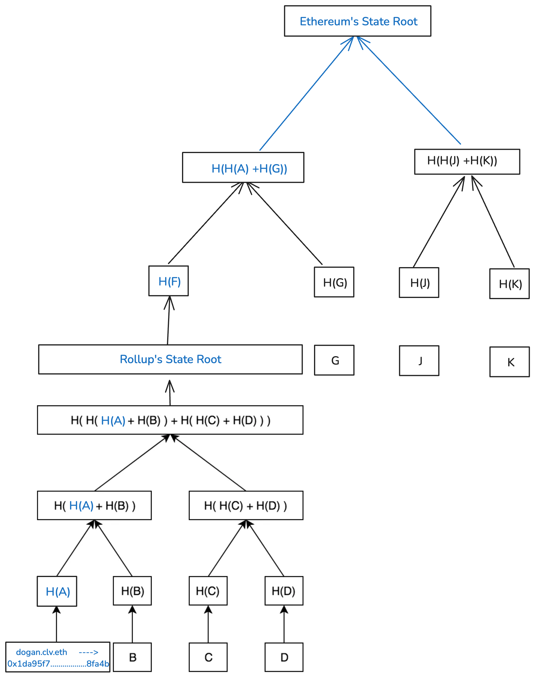
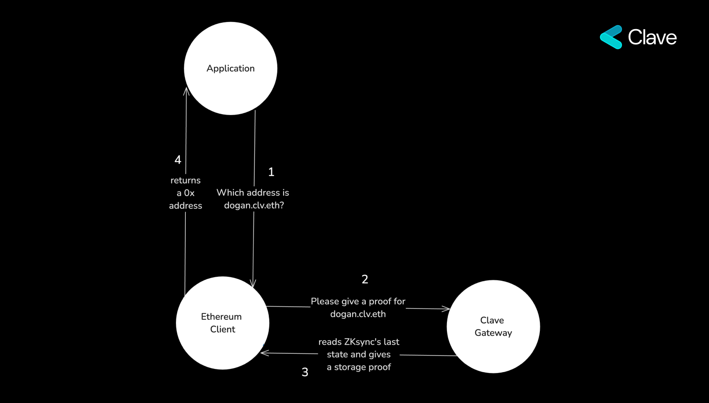

Ethereum Name Service (ENS), Ethereum blokzinciri üzerine inşa edilmiş merkeziyetsiz, açık ve genişletilebilir bir adlandırma protokolüdür. ENS, 'alice.eth' gibi insan tarafından okunabilir adları Ethereum adresleri, diğer kripto para adresleri, içerik hash'leri, meta veriler ve daha fazlası gibi makine tarafından okunabilir tanımlayıcılara dönüştürür. Ayrıca, Ethereum adreslerinin birincil adlar veya arayüz açıklamaları gibi meta verilerle ilişkilendirilmesine olanak tanıyan 'ters çözümleme' özelliği de sunar.

.eth ve .test gibi Üst Düzey Alan Adları (TLD'ler), kayıtçılar olarak bilinen akıllı sözleşmeler tarafından yönetilir. Bu kayıtçılar, alan adları içinde isimlerin tahsisi için kuralları tanımlar ve Alan Adı Sistemi (DNS) ile sorunsuz uyumluluk sağlar.

Kullanıcılar bir ad kaydettirdiğinde, genellikle .eth TLD'si altında bir ikinci düzey alan adı (2LD) kaydettirirler—örneğin, 'clv.eth'. ENS adları ayrıca alt alan adları oluşturabilir; örneğin, 'clv.eth', 'dogan.clv.eth'i oluşturabilir.

**CCIP-Read (ERC-3668)**, verilerin herhangi bir kaynaktan istemci tarafında bir yöntem kullanılarak alınmasını sağlar. Bu özellik, özellikle zincirler arası ve zincir dışı subname çözümleyicileri için kullanışlıdır. Temel ENS protokolü Ethereum üzerinde çalışırken, CCIP-Read, subname'lerin zincir dışı ortamlar ve rollup'lar ile genişletilmesine esneklik sağlar ve ENS işlevselliğini Ethereum blokzincirinin ötesine genişletir.

Eğer bir ENS subname'i bir Ethereum rollup'ı üzerinde yaşıyorsa ve güvenilmezliği korumayı hedefliyorsa, CCIP çözümü depolama kanıtları gerektirir. Bu kanıtlar, subname'in onchain olarak var olduğunu ve çözümleyici hesaplamasının doğru olduğunu doğrular. Bu, subname'in durum kökünün Ethereum'da yaşayan rollup'ın bir parçası olduğuna dair kriptografik kanıt sağlayarak, verilerin güvenilirliğini zincir dışı ortamlarda bile korur.

## ZKsync'in Depolama Kanıtlarını Nasıl Çalışıyor?
ZKsync, Ethereum için bir katman-2 ölçeklendirme çözümüdür ve işlem kapasitesini artırıp ve ücretleri düşürürken Ethereum ağının güvenliği ve merkeziyetsizliğini korur. ZKsync, hesap durum köklerini ve Sıfır Bilgi İspatlarını Ethereum'a göndererek işlemlerin doğruluğunu sağlar. ZKsync, EVM uyumlu bir blokzincir olmasına rağmen, Ethereum'un SHA-256 hashing algoritmasından farklı olan Blake2 adlı bir hashing yöntemi kullanır.

Ethereum, Merkle Patricia ağacı adı verilen özel bir Merkle ağacı yöntemini kullanır, bu da herhangi birinin belirli bir depolama parçasının durum kökünün bir parçası olduğunu ve geçerli olduğunu doğrulayan depolama kanıtları oluşturmasına olanak tanır. Bu, bir rollup üzerindeki verilerin gerçek olduğunu ve Ethereum'daki rollup'ın durumuna entegre olduğunu kanıtlamamıza olanak tanır. Bu ZKsync için de benzerdir, ancak önemli bir farkla: hashing yöntemi. ZKsync üzerindeki bir depolama slotunu kanıtlamak için Blake2 algoritmasını kullanmanız gerekir.

Clave, CCIP okumasında depolama slotlarını kullanır, bunu açıklamak için CCIP'nin temel düzeyde nasıl çalıştığına bir göz atalım.

Zincirler Arası Etkileşim Protokolü (CCIP Read), zincir dışı veri alımını güvenli ve merkeziyetsiz bir şekilde kolaylaştırmak için tasarlanmış bir istemci tarafı protokoldür. Bu protokol, istemcinin belirli zincir dışı veri isteklerini işlemesi için tetikleyici olarak hareket eden `OffchainLookup` hatasını tanıtır.

İstemci `OffchainLookup` hatasıyla karşılaştığında, belirtilen bir ağ geçidi URL'sini çağırarak yanıt verir, bu durumda Clave Gateway'dir. Clave Gateway daha sonra istenen subname için bir depolama kanıtı sağlar. İstemci bu kanıtı doğrulayarak subname verilerinin güvenilir ve güvenilmez olduğunu garanti eder. Bu mekanizma, Clave subname'lerini Clave'den bağımsız şekilde çalışabilir ve güvenliğini Ethereum'dan alabilir hale getirir. 

İşte `OffchainLookup` hatası tanımı:

```
error OffchainLookup(
    address sender,
    string[] urls,// Clave Gateway'i çağırır
    bytes callData,
    bytes4 callbackFunction,
    bytes extraData
);
```
daha fazla bilgi edinmek için [ENS'nin web sitesini](https://docs.ens.domains/resolvers/ccip-read) inceleyebilirsiniz.

Ancak, istemcilerin 30 milyon gaz sınırı vardır, oysa mevcut Blake2 Solidity doğrulayıcıları yaklaşık 1 milyar gaz tüketmekteydi, bu da yöntemimizi pratik hale getirmiyordu. Bu sınırlamanın üstesinden gelmek için, ENS ile birlikte Blake2 hashing algoritmasını verimli bir şekilde gerçekleştiren ve gaz tüketimini 30 milyon gaz sınırının altında tutan bir kütüphane geliştirdik.

### Clave Kullanıcı Adını Çözme Sürecinin Mevcut Akışı Şu Şekildedir:

1. Bir uygulama, `dogan.clv.eth` ile ilişkilendirilen adres için Ethereum istemcisine sorgu gönderir.
2. Ethereum istemcisi, bir kanıt için Clave Gateway'i çağırır.
3. Clave Gateway, zincir üzerinde adı kanıtlamak için gerekli olan verileri ve depolama kanıtını sağlar.
4. Ethereum istemcisi kanıtı simüle eder ve uygulamaya karşılık gelen `0x` adresini döndürür.

Bu süreç tamamen güvenilmezdir ve sıfır ücret içerir!


## ZKsync'te İsimleri Nasıl Saklıyoruz

ENS protokolünün temelinden büyük ilham aldık ve Clave kullanıcı adlarını değiştirilemez, merkeziyetsiz ve ücretsiz hale getirmeye karar verdik. Clave kullanıcı adları Clave adreslerine özgüdür ve bir kullanıcı adı zincir üzerinde kaydedildiğinde, ne kullanıcı ne de Clave tarafından değiştirilemez.

Clave kullanıcı adları devredilemez ve değiştirilemez, bu da kullanıcılar için benzersizliğini sağlar.

```solidity
function _beforeTokenTransfer(address from, address to, uint256) internal view override {
    require(
        from == address(0) || to == address(0),
        '[_beforeTokenTransfer] Transfers are not allowed..'
    );

    require(
        to == address(0) || balanceOf(to) == 0,
        '[_beforeTokenTransfer] Already have name.'
    );
}
```
