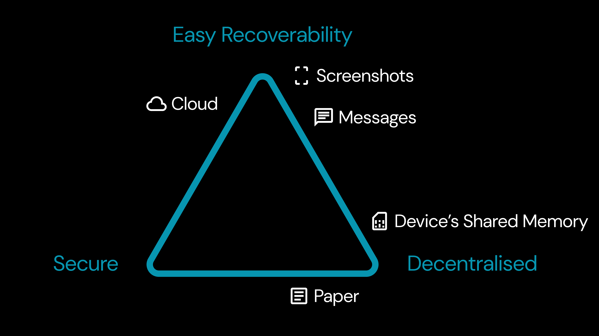

Anahtar yönetimi, yalnızca kripto dünyasında değil, dijital dünyada da "sahiplik" kavramı etrafında dönen yaygın bir sorundur. Dijital sahiplikle ilgili en büyük zorluk, aynı anda **kurtarılabilirlik (I)**, **güvenlik (II)** ve **merkeziyetsizlik (III)** sağlayan tek bir anahtar yönetim çözümünün olmamasıdır.

Clave Uygulaması, en güvenli anahtar mekanizmasını en kolay kurtarma mekanizmalarıyla birleştirerek bu sorunu ele alır ve böylece bu üç özelliği bir arada sunar. Güvenlik için Clave, **Passkey Signer** kullanır. Kurtarılabilirlik için ise **Sosyal Kurtarma** ve **Evrensel Kurtarma** kullanır. Bu anahtarlar, akıllı sözleşmeler aracılığıyla zincir üzerinde doğrulanır, bu da kullanıcılara varlıkları üzerinde tam kontrol sağlar ve başkalarının bu varlıklara erişimini engeller.

