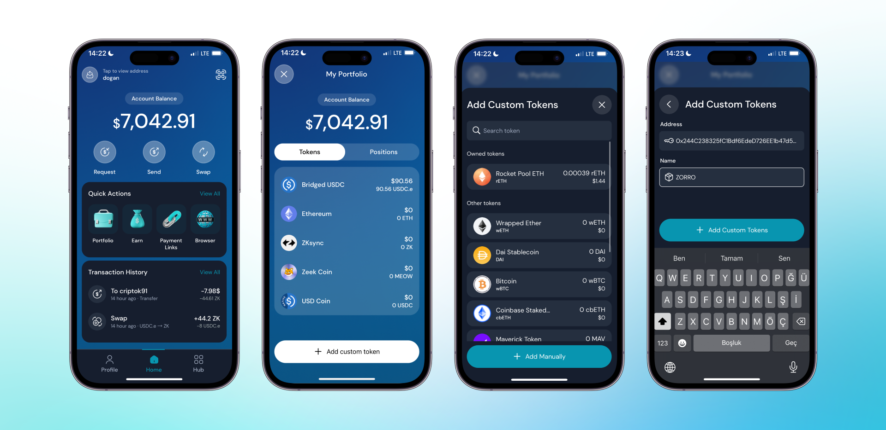

Varlıklarınızı takip etmek için manuel tokenler eklemek için iki seçenek bulunuyor. İlk seçenek, tokenin adını aratarak bulmak, ikinci seçenek ise tokenin sözleşme adresini kopyalayıp Clave'e yapıştırmaktır. Clave cüzdanınıza manuel tokenler eklemek için şu adımları izleyin:

1. **Clave uygulamasını açın** ve ana ekrana gidin.
2. **"Hesap Özeti"ne tıklayın** ve hesap bakiyenizi ve tokenlerinizi görüntüleyin.
3. **Aşağı kaydırın ve Tokenler listesinin en altındaki "Manuel ekle" seçeneğine tıklayın.**
4. Eklemek istediğiniz **tokeni arayın**. Listede görünüyorsa, seçin.
5. Eğer token listede görünmüyorsa, **"Manuel Ekle" seçeneğine tıklayın**.
6. **Tokenin sözleşme adresini ve adını girin.**
7. **"Manuel Token Ekle"ye tıklayın** ve işlemi tamamlayın.

Artık manuel token eklemeyi bildiğinize göre, tüm varlıklarınızı Clave uygulaması içinde kolayca yönetebilirsiniz.
