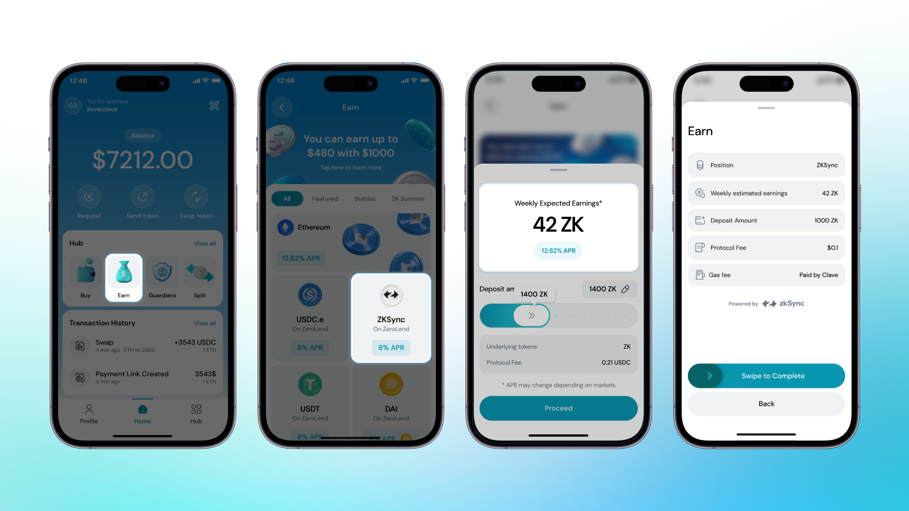

Clave'de, kullanıcıların varlıklarını bu havuzlarda stake ederek pasif gelir elde etmelerini sağlamak için DEX Havuzları ve tek taraflı getiri havuzlarını entegre ettik.

Kazanç merkezinde para kazanmak için önce fonlanmış bir cüzdana ihtiyacınız var. Eğer Clave'e fon yatırmadıysanız, bu rehberi takip edin: [Cüzdanınızı ZKsync Üzerinde Nasıl Fonlarsınız](how-to-fund-your-wallet-on-zksync).

Hesap Soyutlama sayesinde, kullanıcıların merkeziyetsiz finans uygulamalarını kullanırken birden fazla işlem yapmasına gerek kalmaz, tüm işlemleri yalnızca tek işlemde yapabilirler. Bu yüzden Clave üzerinde kazanç sağlamak sadece bir tık uzağınızda!

**Kazanmaya Başlama Rehberi:**

1. **Hub'a Git ve Yatırım Seçeneğini Seç**: Clave uygulamasını açın, Hub'a gidin ve Yatırım seçeneğini seçin.

2. **Getiri Fırsatlarını Görüntüleyin**: Çeşitli getiri fırsatlarını göreceksiniz; stake etmek istediğiniz varlığı seçin ve devam edin.

3. **Yatırım Miktarını Seçin**: Yatırım Havuzuna ne kadar yatırmak istediğinizi seçin ve devam edin.

4. İşlemi gözden geçirdikten sonra **biyometrik kimlik doğrulamayı tamamlayın**.

Hepsi bu kadar! Kazançlarınızla para kazanmaya başladınız.

### Kazançlarınızı ve Fonlarınızı Nasıl Çekebilirsiniz?

Varlıklarınızı istediğiniz zaman çekebilirsiniz. Kilitlenme süresi yoktur ve kullanıcılar varlıklarını istedikleri zaman serbestçe çekebilirler.

**Fonları Nasıl Çekebilirsiniz?**

1. **Earn Hub'a Git** ve çekmek istediğiniz pozisyonu seçin.

2. **Çek** düğmesine tıklayın.

3. **Çekmek İstediğiniz Miktarı Girin**.

4. **Topla ve Çek** düğmesine tıklayın ve fonlarınız çekilecektir.

İşlem tamam! Artık fonlarınızı çektiniz ve onları istediğiniz yerde kullanabilirsiniz.

Bu getiri nereden geliyor? Bir sonraki bölümde öğrenelim:
