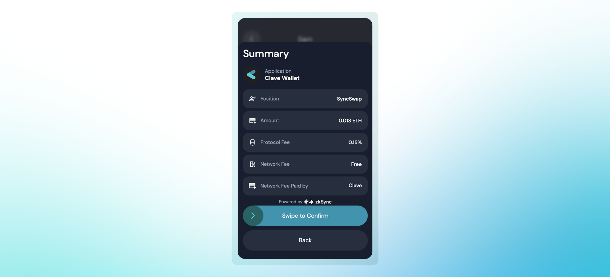

Clave iki tür kazanç sunar: Toplanabilir ve Bileşik. Toplanabilir kazançlar, anında likidite ve esneklik sağlar, bu sayede fonları istediğiniz zaman çekip kullanabilirsiniz. Bileşik kazançlar ise otomatik olarak yeniden yatırıma yönlendirilir, bu da bileşik faiz aracılığıyla getirileri maksimize eder. Her iki yöntem de kilitlenme süresi olmadan kazançlarınıza 7/24 erişim sağlar.

## Toplanabilir Kazançlar
Toplanabilir kazançlar, istediğiniz zaman çekip kullanabileceğiniz fonlardır. Bu kazançlar anında likidite ve esneklik sağlar, böylece yeniden yatırım yapma, harcama veya tasarruf etme seçeneklerine sahip olursunuz. 
ZK staking sözleşmemiz, toplanabilir kazanç yöntemini kullanarak size esneklik ve ödüllerinize istediğiniz zaman erişim imkanı sunar.

## Bileşik Kazançlar
Bileşik kazançlar, havuza otomatik olarak yeniden yatırılır, bu da zamanla kazançlarınızın daha fazla gelir elde etmesini sağlar. Bu yöntem, bileşik faizin gücünden yararlanarak uzun vadede getirilerinizi maksimize eder. Her iki kazanç yöntemiyle de kazançlarınıza ve varlıklarınıza kilitlenme süresi olmadan 7/24 erişebilirsiniz.
ZeroLend ve AAVE havuzları, kullanıcılarımıza en iyi getiri oranlarını sunmak için bu yöntemi kullanır, böylece fonlarınıza ihtiyacınız olduğunda her zaman erişebilirsiniz.

<AccordionGroup>
    <Accordion title="Neden bazı protokoller, Earn'e fon yatırırken bir ücret alır?">
        AMM havuzlarına LP eklemek ekstra bir risk taşır: Geçici Kayıp. Bu riski en aza indirmek için, yalnızca aynı varlık kategorisine sahip havuzları (örneğin, WstETH/ETH) kullanıyoruz. Böylece, fiyat değişikliği ve Geçici Kayıp riski de minimum düzeydedir.
        
    </Accordion>
</AccordionGroup>

