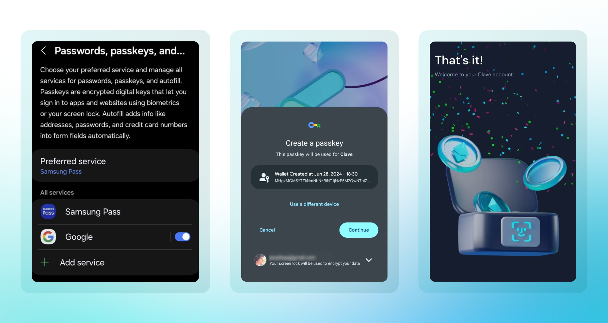

Google Password Manager, hesaplarınıza kolay ve güvenli erişim sağlamak için passkey kullanmanıza olanak tanıyan güvenli bir araçtır. İşte nasıl kuracağınıza dair rehber:

1. **Google Password Manager'ı Açın:** 'Hesap Oluştur' düğmesine tıkladığınızda, hesap oluşturma sırasında Google Password Manager'ı seçebilirsiniz.
2. **Ayarlar Menüsüne Gidin:** Google Password Manager'da ayarlar menüsüne gidin.
3. **Passkey'i Etkinleştirin:** Passkey'leri etkinleştirme seçeneğini bulun ve bu seçeneği açın.
4. **Biyometrik Kimlik Doğrulamayı Ayarlayın:** Parmak izi veya yüz tanıma ayarlarını yapmak için ekrandaki talimatları izleyin.

Yapılandırma tamamlandıktan sonra, parolalarınıza ve hesaplarınıza hızlı ve güvenli bir şekilde erişmek için biyometrik verilerinizi kullanabilirsiniz.

Bunun ardından, Clave uygulamasını açıp sadece tek bir tıklama ile hesap oluşturabilirsiniz!

1. **Clave Uygulamasını İndirin ve Açın**
2. **Hesap Oluştur** düğmesine tıklayın
3. **Devam** düğmesine tıklayın
4. **Biyometrik kimlik doğrulamayı** tamamlayın

Ve işte bu kadar! Artık Clave ile sorunsuz bir onchain deneyiminin keyfini çıkarabilirsiniz.
