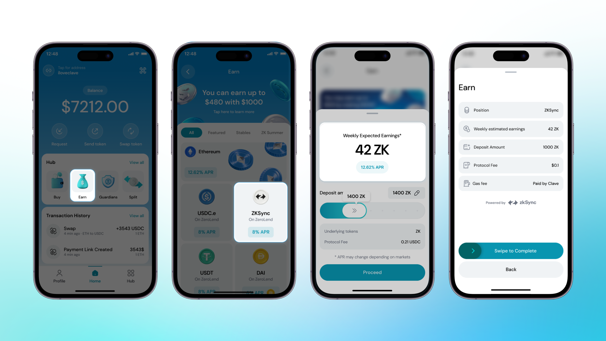
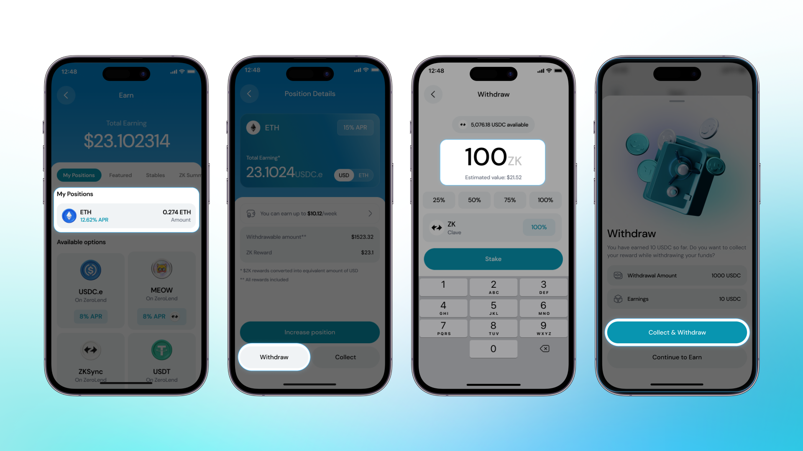

Clave, DeFi uygulamalarına kolayca erişmenizi sağlayan, kendi varlığınıza kendiniz sahip olduğunuz bir cüzdandır. Clave, Earn hub'da çeşitli getiri seçenekleri sunar. Şimdi varlıklarınızı nasıl stake edeceğinizi ve getiri kazanacağınızı açıklayalım:

Earn Hub'da para kazanmak için önce fonlanmış bir cüzdana ihtiyacınız var. Eğer Clave'e fon yatırmadıysanız, bu rehberi takip edin: [Cüzdanınızı ZKsync Üzerinde Nasıl Fonlarsınız](how-to-fund-your-wallet-on-zksync).

**Earn Hub'a Fon Yatırma:**

Hesap Soyutlama sayesinde, kullanıcıların DeFi uygulamalarını kullanırken birden fazla işlem yapmasına gerek kalmaz. Bu yüzden Clave üzerinde kazanç sağlamak sadece bir tık uzağınızda!

1. **Hub'a Git ve Yatırım Seçeneğini Seç**:
   - Clave uygulamasını açın, Hub'a gidin ve Yatırım seçeneğini seçin.

2. **Getiri Fırsatlarını Görüntüleyin**:
   - Çeşitli getiri fırsatlarını göreceksiniz. Stake etmek istediğiniz varlığı seçin ve devam edin.

3. **Yatırım Miktarını Seçin**:
   - Yatırım Havuzuna ne kadar yatırmak istediğinizi seçin ve devam edin.

Hepsi bu kadar! Kazançlarınızla para kazanmaya başladınız.

### Kazançlarınızı Nasıl Talep Edebilir ve Fonlarınızı Nasıl Çekebilirsiniz?

Varlıklarınızı istediğiniz zaman çekebilirsiniz. Kilitlenme süresi yoktur ve kullanıcılar varlıklarını istedikleri zaman serbestçe çekebilirler.

#### Fonları Nasıl Çekebilirsiniz

1. **Earn Hub'a Git ve Pozisyonunuzu Seçin**: Clave uygulamasında Earn Hub'a gidin ve çekmek istediğiniz pozisyonu seçin.

2. **Çek** düğmesine tıklayın.

3. **Çekmek İstediğiniz Miktarı Girin**: Çekmek istediğiniz miktarı girin.

4. **Topla ve Çek** düğmesine tıklayın ve fonlarınız çekilecektir.

İşlem tamam! Artık fonlarınızı çektiniz ve onları istediğiniz yerde kullanabilirsiniz.

