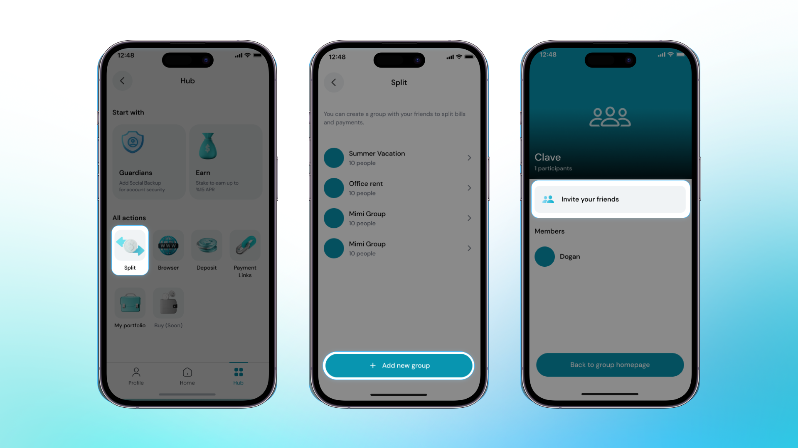

Bir seyahatte olduğunuzu ve arkadaşlarınızla masrafları paylaşmak istediğinizi hayal edin. Clave uygulamasındaki Harcama Bölüştürme fonksiyonu bunu kolay ve sorunsuz hale getirir. Basitçe bir bölüştürme grubu oluşturun, arkadaşlarınızı ekleyin ve masrafları paylaşmaya başlayın. İster yemekler, ister konaklamalar, ister aktiviteler olsun, Clave masrafları adil bir şekilde bölmenize yardımcı olur ve her şeyi düzenli tutar. Birkaç tıklamayla herkesin payını ödediğinden emin olabilir ve seyahatinizi daha sorunsuz ve keyifli hale getirebilirsiniz.

Clave uygulamasında bir harcama bölüştürme grubu oluşturmak ve arkadaş eklemek basit ve verimlidir. Başlamak için şu adımları izleyin:

1. **Cihazınızda Clave Uygulamasını Açın** ve "Hub" bölümüne gidin.

2. **Bölüştürme Seçeneğini Seçin**: Hub'da, "Bölüştürme" simgesini bulun ve seçin.

3. Ekranın altındaki **Yeni Bir Grup Oluştur** düğmesine tıklayın.

4. **Bölüştürme grubunuz için bir isim girin**, örneğin "Arkadaşlar Yemeği" veya "Seyahat Masrafları."

5. **"Arkadaşlarını Davet Et"e tıklayarak grubunuza üye ekleyin.** Arkadaşlarınızı e-posta adreslerini girerek veya kişilerinizden seçerek davet edebilirsiniz.

Tebrikler! Bir harcama bölüştürme grubu oluşturup arkadaşlarınızı eklediniz. Artık Clave uygulaması içinde faturaları kolayca bölebilir ve ortak masrafları yönetebilirsiniz.

Bölüştürme fonksiyonunu nasıl kullanacağınızı öğrenmek için bir sonraki bölüme geçin ->
