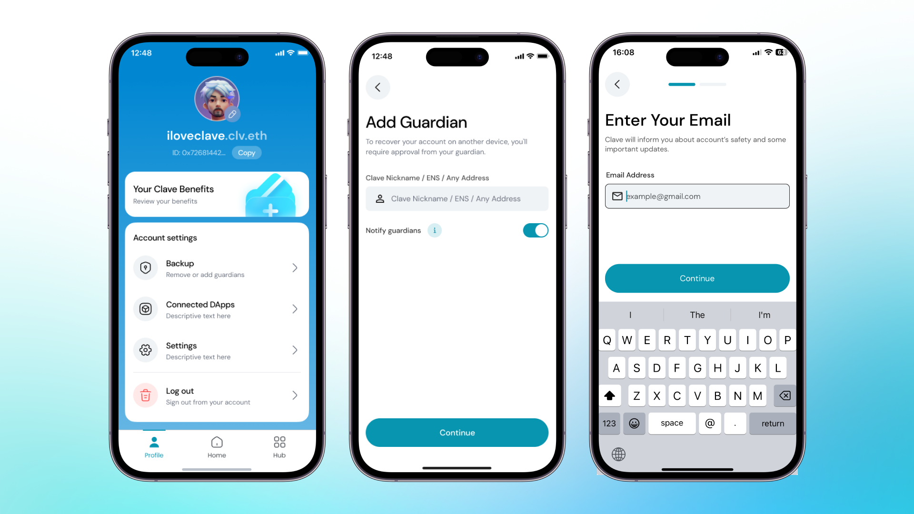

---
title: 'Clave Hesabınıza Güvenilir Kişiler Atama'
description: 'Sosyal kurtarma için Clave hesabınıza güvenilir kişiler atama rehberi.'
---İşte metnin Türkçe çevirisi:

Sosyal kurtarma, bir aile üyesini, arkadaşınızı veya diğer cüzdanlarınızı hesabınız için güvenilir kişi olarak atamanıza olanak tanır. Bu sayede, hesabınıza erişiminizi kaybetseniz bile, güvendiğiniz kişiler yardımıyla hesabınızı güvenli bir şekilde geri alabilirsiniz.

Bir güvenilir kişi eklemek için şu adımları izleyin:

1. **Clave Uygulamasını Açın** ve profilinize gidin.
2. Başlangıçta yedekleme sürecini ayarlamanızı sağlayacak olan **Sosyal Yedekleme** seçeneğini seçin.

3. **Kullanıcı adı, ENS veya 0x adresini girerek Güvenilir Kişiler Ekleyin.** Güvenilir kişiler, hesabınıza erişim kaybettiğinizde size yardımcı olabilir. Her zaman en az bir güvenilir kişi atadığınızdan emin olun.

4. **E-posta Adresinizi Girin**: Hesabınızın güvenliği ve önemli güncellemeler hakkında bildirim almak için e-posta adresinizi sağlayın. Kurtarma işlemleri veya hesabınızı güvende tutmak için gereken eylemler hakkında bilgilendirileceksiniz.

Clave hesabınıza güvenilir kişiler atamak, varlıklarınızın güvenliğini ve geri alınabilirliğini önemli ölçüde artırır. İhtiyaç anında size yardımcı olacak güvendiğiniz kişiler veya cüzdanlarınızın olması size gönül rahatlığı sağlar.
