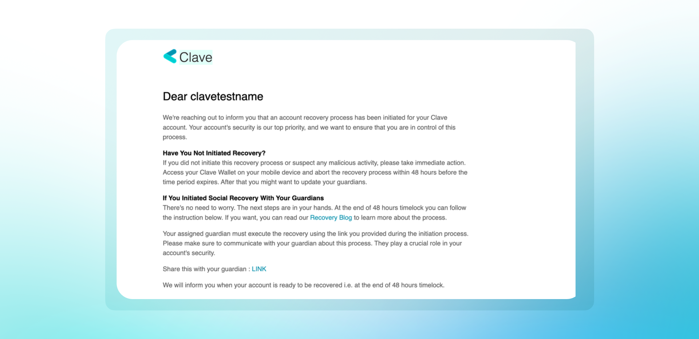

Clave'de, sosyal kurtarma cüzdanınızı güvenli bir şekilde geri almanın bir yolunu sağlar. Eğer izniniz olmadan bir kurtarma süreci başlatılırsa, bu girişimi iptal etmek için 2 günlük bir bekleme süreniz vardır. Kötü niyetli bir kurtarma girişimini nasıl iptal edebileceğinizi burada bulabilirsiniz:

1. **E-postanızı ve cihaz bildirimlerinizi kontrol edin:** Bir kurtarma süreci başlatıldığında, Clave'den bir e-posta bildirimi ve uygulama bildirimi alırsınız.

   

2. **Clave Uygulamasını Açın:** Ana ekranda, hesabınız için bir sosyal kurtarma sürecinin başladığını belirten bir bildirim göreceksiniz.

3. **Bildiriye Tıklayın:** Bildirim, kurtarma sürecini 48 saat içinde iptal etmenizi isteyecektir.

4. **Kurtarma Sürecini İptal Edin:** "Kurtarmayı İptal Et" düğmesine tıklayın, özeti gözden geçirin ve onaylamak için kaydırın.
5. **İşlemi başlatmak için açılacak Biyometrik Kimlik Doğrulamayı** tamamlayın.
6. **Onay Mesajını Alın:** Kurtarma sürecini başarıyla iptal ettikten sonra bir onay mesajı göreceksiniz.

   

Eğer güvenilir kişinizin güvenliği tehlikeye girdiğinden veya kötü niyetli davrandığından şüpheleniyorsanız, onları sosyal kurtarma ayarınızdan çıkarmalısınız. Bir güvenilir kişiyi kaldırmak için bir sonraki rehberi takip etmelisiniz.

