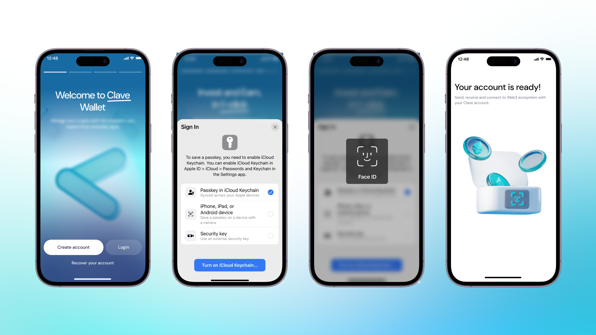
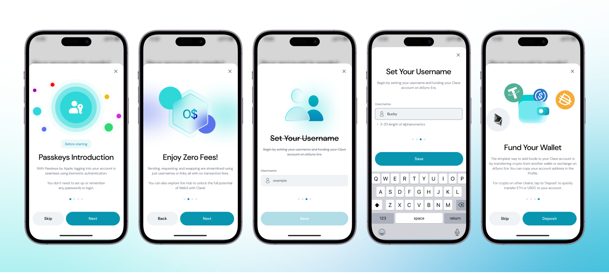
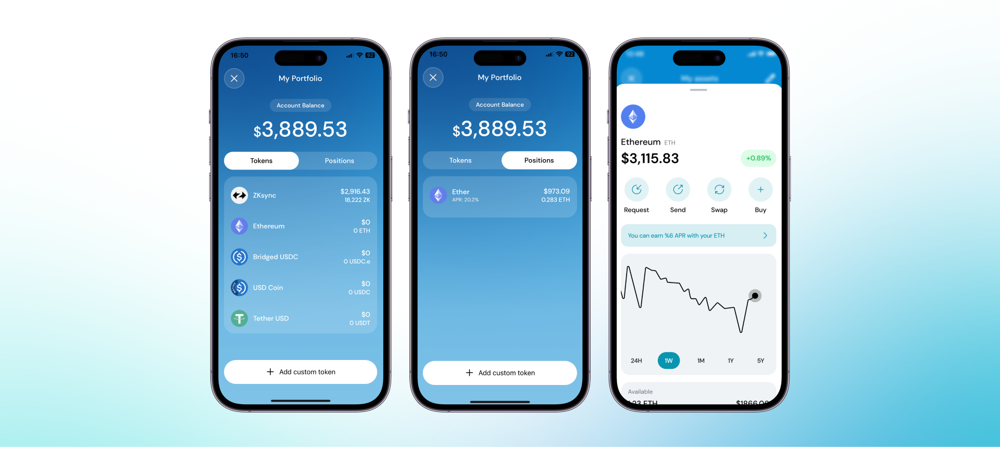

Clave ile hesap oluşturmak basit ve güvenlidir. Geleneksel özel anahtarlar ve anımsatıcı kelimeler yerine passkeyi kullanarak, Clave en yüksek güvenlik standartlarıyla kolay bir hesap oluşturma süreci sağlar. Yeni Clave hesabınızı oluşturmak ve kripto paralarınızı kolayca yönetmeye başlamak için adım adım rehberimizi izleyin.

Clave, özel anahtarlar ve anımsatıcı kelimeler yerine passkey'ler kullanan akıllı bir cüzdandır. Bu teknolojiler, [Apple](https://support.apple.com/en-us/102195?ref=blog2.getclave.io) ve [Google](https://support.google.com/accounts/answer/13548313?hl=en&ref=blog2.getclave.io) tarafından desteklenir, bu nedenle Clave, kullanıcılarına en yüksek güvenlik ve fonlarını kontrol etmenin en kolay yolunu sunmak için son derece güvenli şifreleme teknikleri kullanır. Bu yeni geliştirmeler sayesinde, karmaşık özel anahtarlar veya anımsatıcı kelimeler hakkında endişelenmenize gerek kalmaz ve telefonunuzu bir donanım cüzdanına dönüştürebilirsiniz!

Şimdi, App Store veya Google Play Store'a gidin ve [Clave'i indirin](http://getclave.io/download?ref=blog2.getclave.io).

Clave'i indirdikten sonra,

1. **Uygulamayı açın** ve “Yeni Hesap Oluştur”a tıklayın.
2. **Face ID** ile giriş yapın.

Voila! Hesabınızı oluşturdunuz!
Hesap oluşturma ile ilgili bir sorun yaşarsanız, daha fazla yardım için [rehber](./problem-solving) sayfamıza göz atabilirsiniz.

## **Hesabınızı Ayarlama**

Tebrikler, hesabınızı oluşturdunuz, şimdi onu ayarlama zamanı!

1. **Passkey'ler Hakkında Bilgilendirme:** Passkey'ler, biyometrik kimlik doğrulama ile şifresiz hesap oluşturmayı sağlar.
2. **Sıfır Ağ Ücreti:** Clave'i kullanırken Sıfır Ağ Ücreti ödemenin keyfini çıkarın. Evet, doğru okudunuz, Clave kullanıcıları için işlemler ücretsizdir!
3. **Kullanıcı Adı:** Cüzdanınıza eşleşecek bir kullanıcı adı belirlemeniz istenecek, böylece uzun ve karmaşık bir cüzdan adresi hakkında endişelenmenize gerek kalmaz. Clave'de hayatınızı kolaylaştırmak için ihtiyacınız olan tek şey kullanıcı adınızdır! Ve bu kullanıcı adlarını her yerde kullanabilirsiniz!
4. **Yatırım:** Başka bir cüzdanda veya merkezi bir borsada kriptonuz varsa, ZKsync Era Mainnet üzerinde Clave hesabınıza doğrudan adresinize göndererek yatırım yapabilirsiniz. Ayrıca, ortaklarımızdan Layerswap sayesinde cüzdanınızı farklı zincirlerden sorunsuz bir şekilde fonlayabilirsiniz!

Hesap oluşturuldu, ayarlandı ve fon yatırıldı. Şimdi, Clave cüzdanınızla merkeziyetsiz finans dünyasına dalmaya hazırsınız.

Ücretsiz işlemler, sorunsuz bir kullanıcı arayüzü ve en iyi kullanıcı deneyiminin keyfini çıkarın!

## **Ana Sayfa**

“Ana Sayfa”, hesabınız için bir kontrol panelidir. Burada:

- Bakiyenizi kontrol edebilir,
- Sahip olduğunuz tokenleri gösteren portföyünüzü görebilir,
- İşlem geçmişinizi inceleyebilir,
- Kripto para talep edebilir/gönderebilir/takas edebilir,
- Aşağı kaydırarak varlıklarınızı görebilir ve manuel tokenler ekleyebilirsiniz.

**Şimdi ne yapmalı?**

Clave dünyasına dalmaya hazırsınız. 
