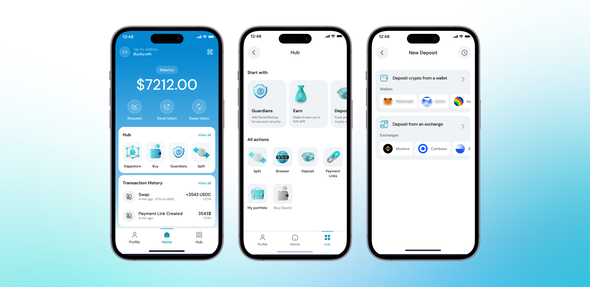
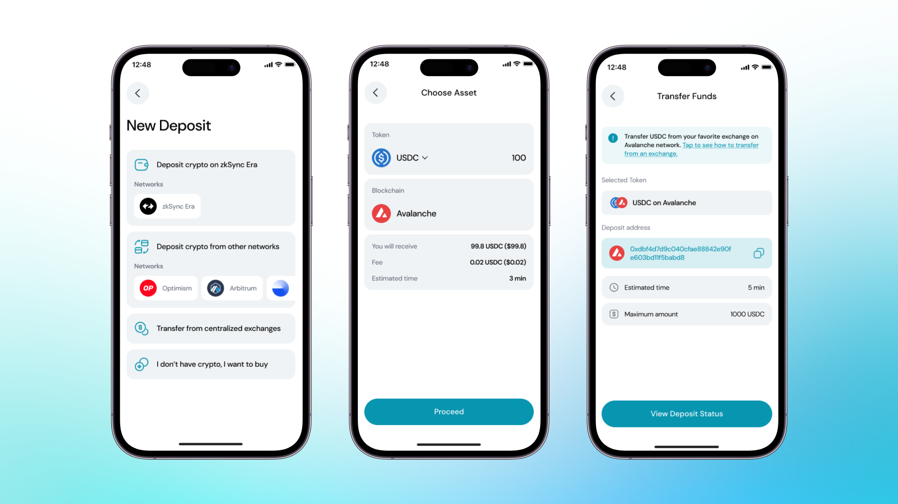

Clave, Layerswap partnerliğinde, kripto varlıklarınızı ZKsync Era Mainnet'e aktarmayı her zamankinden daha kolay hale getiriyor. Bu güçlü ortaklık sayesinde, desteklenen herhangi bir blokzincirinden fonlarınızı hızlı ve uygun maliyetli bir şekilde yatırabilirsiniz.

### Cüzdanınızı diğer zincirlerden fonlamak için şu adımları izlemelisiniz:

1. **Clave**'i Açın

2. **Hub**'ı seçin: Bu, Clave'de yapabileceğiniz tüm işlemleri, **Yatırma** dahil, görmenizi sağlar.

3. **Yatır**'a seçin: Burada, fonlarınızı gönderebileceğiniz tüm zincirleri görebilirsiniz.

4. **Hangi tokeni** ve **ne kadar** yatırmak istediğinizi seçin.

5. Diğer cüzdanlarınızda kripto tokenlerinizin bulunduğu **ağı seçin**.

6. Seçtiğiniz ağda tokenlerinizi **Yatırma Adresi**'ne gönderin.
    i. Örneğin, verilen adrese Avalanche üzerinde 1000 USDC gönderin.
    ii. Transfer tamamlandığında, tokenleriniz otomatik olarak Clave hesabınıza yatırılacaktır.
7. **Yatırım durumunu kontrol edin.**
    - Yatırım durumunuzu "**Bekleyen Yatırımlar**" bölümünden kontrol edebilirsiniz.
    - Fonlarınız cüzdanınıza ulaştığında bir bildirim alacaksınız.

