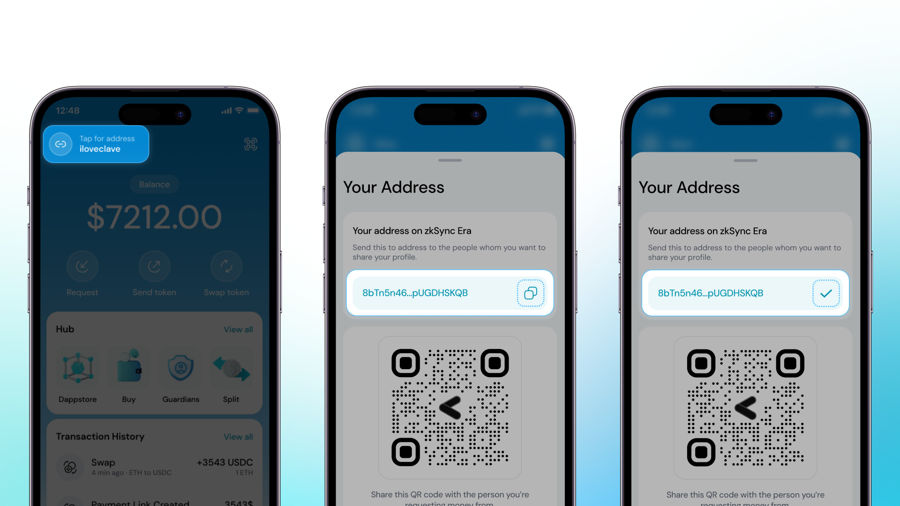
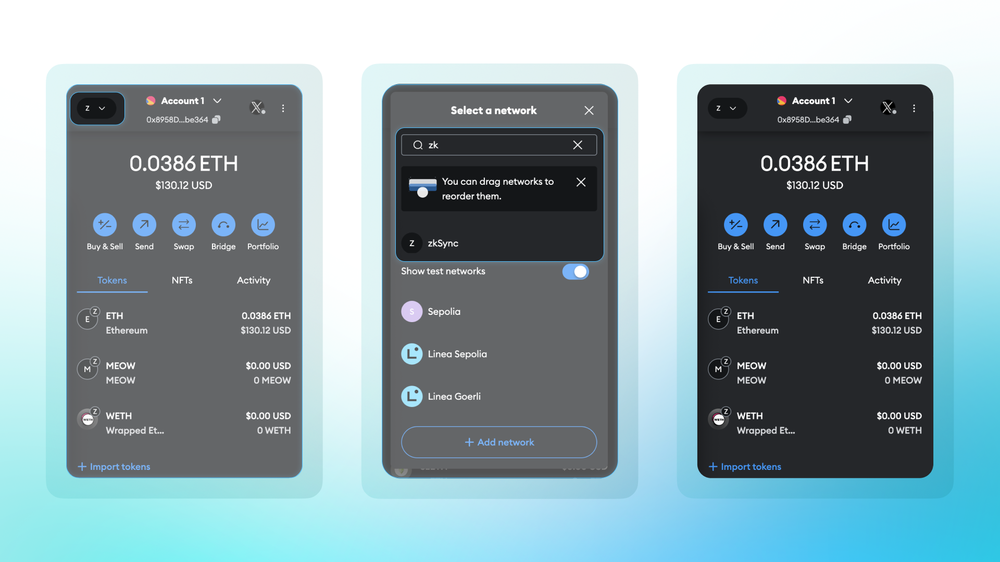
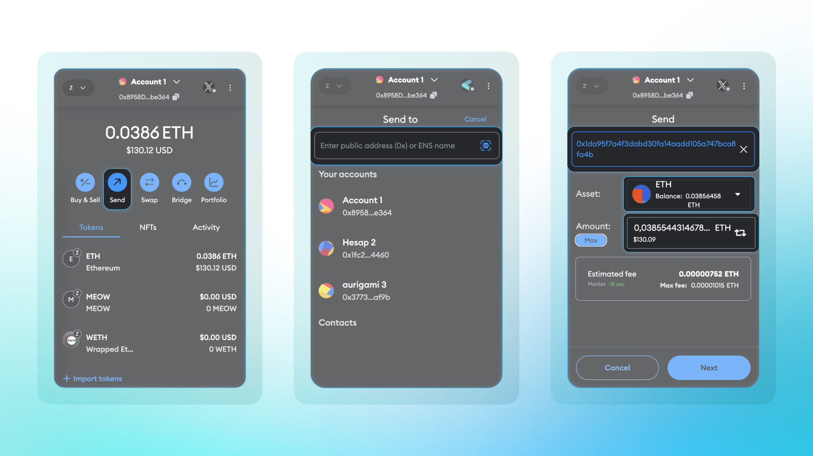
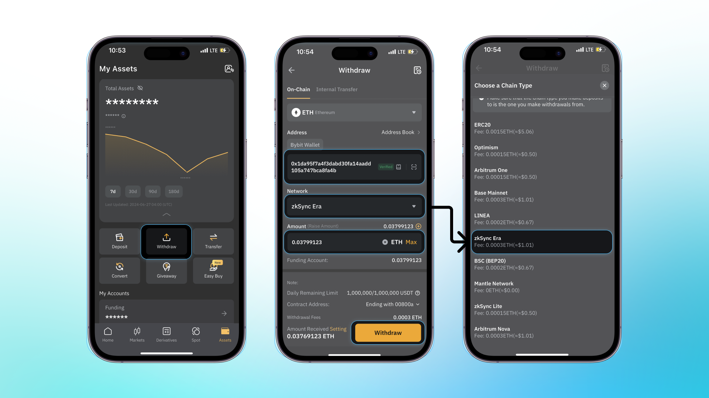

Clave'e henüz fon yatırmadıysanız, sorun değil! İşte CEX'lerden ve diğer cüzdanlardan nasıl fon yatırılacağını anlatan kısa rehber.

**Hesap Adresini Alma:**

1. Öncelikle, adresi görüntülemek için dokunmanız gereken düğmeye tıklayın.
2. Ardından buradan hesap adresinizi kopyalayabilirsiniz, ancak lütfen fonları yalnızca **ZKsync Era ağı** üzerinden yatırabileceğinizi unutmayın.

**Diğer cüzdanlardan fon yatırma:**

1. İlk olarak, **ZKsync Era ağı**nı seçmeniz gerekir. (Bu çok önemlidir çünkü Clave yalnızca ZKsync Era üzerinde çalışır.)

2. **Sonra, gönder düğmesine tıklamanız** ve kopyaladığınız adresi yapıştırmanız gerekir.

3. Ardından, **varlık ve miktarı seçebilir** ve tokenleri Clave hesaplarına gönderebilirsiniz.

**CEX'lerden Fon Yatırma:**

Şu anda, Binance, OKX ve Bybit gibi birçok merkezi borsa (CEX), Clave'e yatırımları desteklemektedir. Bu CEX'lerden fon yatırmak için zkSync çekimlerini desteklemeleri gerekmektedir.

1. Öncelikle **'Çekim' düğmesini seçin** ve çekim ekranını göreceksiniz.

2. Ağ bölümünde **ZKsync Era**yı seçmeli ve kopyaladığınız Clave hesap adresini yapıştırmalısınız.

3. Artık Clave'e fon yatırmaya hazırsınız.