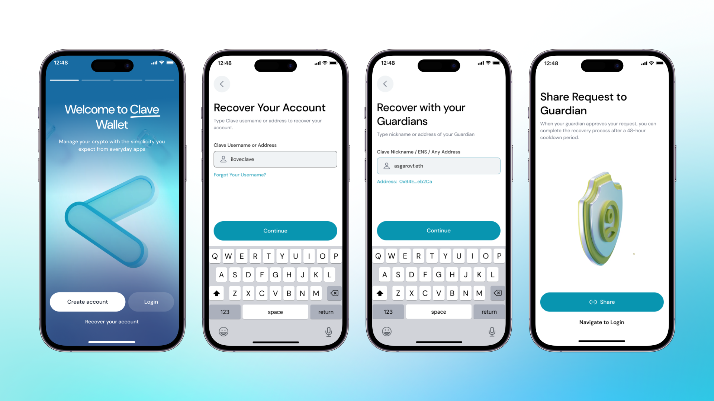

Clave, cüzdanınıza her zaman erişebilemenizi sağlamak için farklı kurtarma mekanizmaları kullanır.

- **Passkey:** İlk kurtarma yöntemi, hesabınızı iCloud ve diğer şifre yöneticileri ßüzerinden kolayca kurtarmanıza olanak tanıyan Passkey'dir.
- **Sosyal Yedekleme:** Diğer bir çözüm, sosyal kurtarma olarak güvenilir kişiler eklemektir. Telefonunuzu kaybederseniz veya başka nedenlerle hesabınıza erişemezseniz, güvenilir kişiniz hesabınızı kurtarabilir.

**Clave Hesaplarıyla Kurtarma**

Normalde, bir EOA cüzdanında anımsatıcı kelimeleri veya özel anahtarları kaybederseniz, hesabınızı kurtarmanın bir yolu yoktur; ancak, Clave'de en az bir güvenilir kişi atadıysanız bir kurtarma yöntemi mevcuttur!

Hesabınızı kurtarmak için şu adımları izlemelisiniz: 
1. Clave'i açtığınızda **“Hesabınızı Kurtarın”** düğmesine tıklayın. 
2. **Kendi kullanıcı adınızı ve güvenilir kişinin kullanıcı adını** yazın. 
3. Bu işlemi tamamladıktan sonra, **Clave güvenilir kişinize bildirimde bulunacak** veya **kurtarma linkini güvenilir kişinizle paylaşabilirsiniz.** 

4. Güvenilir kişi kurtarmayı onayladıktan sonra, **hesap 48 saat içinde kurtarmaya hazır olacaktır.** 
5. **48 saat sonra, size gönderilen aynı linkten kurtarma işlemini tamamlayabilirsiniz.** Dolandırıcılığı önlemek için 48 saatlik bir limit koyuyoruz ve 48 saat içinde kurtarma işlemi sizden gelmezse, işlem iptal edilebilir. 

Not: Hesabınızı iki IOS (veya iki Android) cihaz arasında kurtarmaya çalışıyorsanız, Passkey'lerinize iCloud veya Google Hesabınız üzerinden erişilebilir. Passkey'leriniz yeni cihazınızda doğrudan erişilebilir durumdaysa, hesabınıza 48 saatlik zaman kilidi olmadan doğrudan erişim sağladığı için sosyal kurtarma yerine bunu kullanmanızı öneririz.