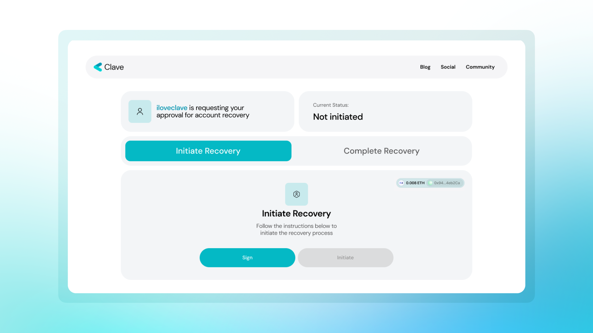
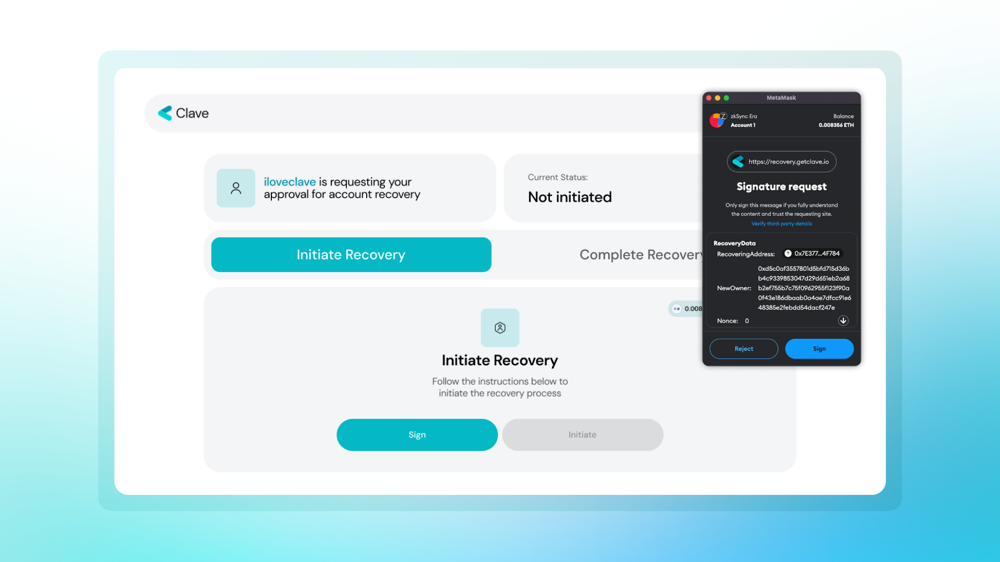
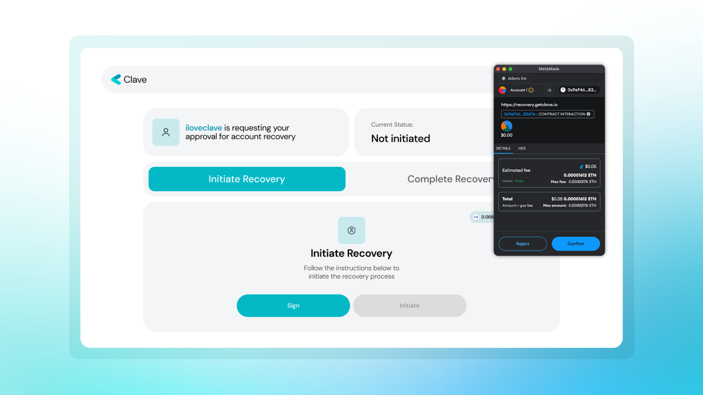
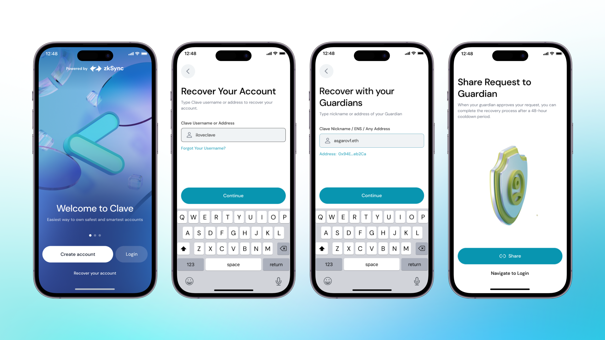
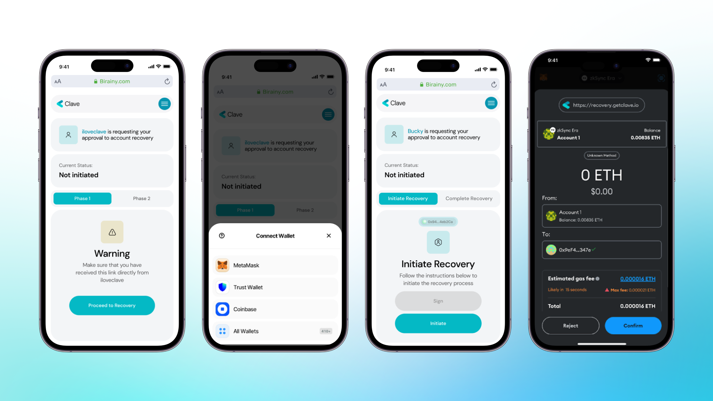
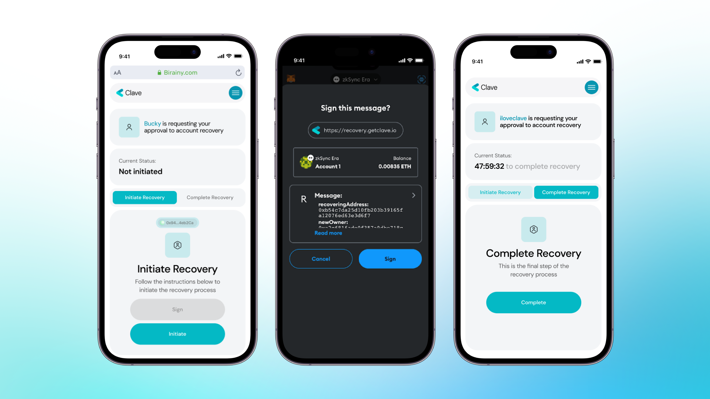

Clave, kullanıcıların hesaplarına her zaman erişebilmelerini sağlamak için farklı kurtarma mekanizmaları uygulamıştır ve bu mekanizmalar donanım seviyesinde güvenliği korur.

Sosyal kurtarma, yalnızca Clave hesaplarıyla sınırlı değildir; aynı zamanda bir EOA cüzdanınızı (Metamask, Rabby, vb.) Clave cüzdanınızı kurtarmak için atayabilirsiniz. Başlangıç süreci, bir Clave kullanıcı adı eklemekle aynıdır: Profile -> Yedekleme kısmına gidip, EOA cüzdan adresinizi yapıştırın, ve hepsi bu kadar!

Ancak kurtarma süreci, Clave kullanıcılarıyla olan kurtarma sürecinden biraz farklıdır.

1. **Ana sayfada “Hesabınızı Kurtarın”** düğmesine tıklayın,
2. **Clave kullanıcı adınızı/cüzdan adresinizi** yazın,
3. **Güvenilir kişinin adresini (EOA cüzdan adresinizi)** yazın,
4. Clave, kurtarma sürecinizi başlatmanız için size sihirli bir **link oluşturacaktır**,

5. O linke gidin ve **cüzdanınızı bağlayın**,

6. **Kurtarma sürecini imzalayın ve başlatın** (ZKsync Era Mainnet üzerinde gas için biraz ETH'ye ihtiyacınız olacak),

7. **Kurtarma süreciniz başladı** ve 48 saat içinde tamamlanacak!

Dolandırıcılığı önlemek için 48 saatlik bir limit koyuyoruz ve bu 48 saat içinde kurtarma işlemi sizden gelmezse, süreç iptal edilebilir.

8. Şimdi, aynı linki kullanarak **güvenilir cüzdanınızla kurtarma işlemini “Yürüt”**ebilirsiniz [recovery.getclave.io](http://recovery.getclave.io/) alan adında.

Mobil telefonlar için adımlar aynı ve akış şu şekildedir:

Not: Lütfen cihazınızda hesabınıza zaten erişiminizin olup olmadığını kontrol edin. Hesabınıza zaten erişiminiz varsa ve güvenilir kişinizden kurtarma talep ederseniz, mevcut passkey'iniz üzerine yazılacaktır.

Not: Hesabınızı iki IOS (veya iki Android) cihaz arasında kurtarmaya çalışıyorsanız, Passkey'lerinize iCloud veya Google Hesabınız üzerinden erişilebilir. Passkey'leriniz yeni cihazınızda doğrudan erişilebilir durumdaysa, hesabınıza 48 saatlik zaman kilidi olmadan doğrudan erişim sağladığı için sosyal kurtarma yerine bunu kullanmanızı öneririz.