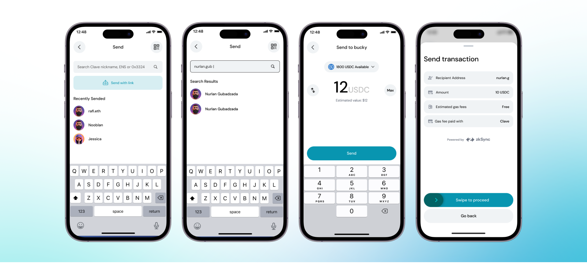

Token, Kripto Para ve Stabilcoin Göndermenin En Kolay Yolu: Clave. Clave'in kullanıcı dostu özellikleriyle fonlarınızı ne kadar zahmetsizce transfer edebileceğinizi keşfedin. İster bir kullanıcı adına gönderin, ister sihirli bir link oluşturun ya da kripto talep edin, Clave süreci basitleştirir ve güvenli işlemler sağlar. Clave'in sorunsuz para transferi yeteneklerinden en iyi şekilde yararlanmayı öğrenmek için detaylı rehberimizi takip edin.

Ana ekrandaki “Gönder” butonuna tıklayarak Clave aracılığıyla kolayca kripto para gönderebilirsiniz.

**A) Clave Kullanıcı Adıyla Gönder**

Bu, başkalarına kripto göndermenin en basit yoludur. Eğer kripto gönderdiğiniz kişinin zaten bir Clave hesabı varsa, sadece kullanıcı adını yazarak gönderebilirsiniz. Kullanıcı adına para göndermek için şu adımları izleyin:

1. **Clave uygulamasını açın** ve "Gönder" butonuna tıklayın.
2. **Kullanıcı Adını Arayın**: Arama çubuğuna alıcının Clave kullanıcı adını, ENS'ini veya cüzdan adresini yazın. Tam kullanıcı adını hatırlamıyorsanız, arama yapabilirsiniz.
3. **Alıcıyı seçin**.
4. **Göndermek istediğiniz kripto miktarını girin.**
5. **İşlem Detaylarını Gözden Geçirin**: alıcı adresi, varlık ve miktar.
6. **Kriptoyu Gönderin**: "Gönder" butonuna tıklayın ve işlemi ilerletmek için kaydırın, ardından biyometrik kimlik doğrulamayı tamamlayın.

Eğer alıcı Clave kullanmıyorsa, ENS'ini ve cüzdan adresini yazabilir veya QR kodunu tarayıp gönderebilirsiniz.

> Onları Clave kullanmaya ikna etmek, herkes için her şeyi daha kolay hale getirecektir.

**Talep Etme**

Ana ekrandaki “Talep Et” butonuna tıklayarak, diğer Clave kullanıcılarından link veya QR kodu ile kripto talep edebilirsiniz.

1. **Clave uygulamasını açın** ve Clave uygulamasının ana ekranına gidin.
2. **Talep Et** butonuna tıklayın.
3. **Miktarı Girin**: Talep etmek istediğiniz miktarı ve tokeni belirtin.
4. **Talebi Oluşturun**: Bir ödeme talebi oluşturmak için "Talep Et" butonuna tıklayın.
5. **QR Kodunu Paylaşın**: Bir QR kodu ve cüzdan adresiniz görüntülenecektir. Bu talebi QR kodunu göstererek veya cüzdan adresini kopyalayarak paylaşabilirsiniz.
6. **Ödeme Talep Linkini Paylaşın**: İsteğe bağlı olarak, mesajlaşma platformları aracılığıyla paylaşmak için bir ödeme talep linki oluşturabilirsiniz.

Şimdi linkinizi veya QR kodunuzu başkalarıyla paylaşabilirsiniz.

